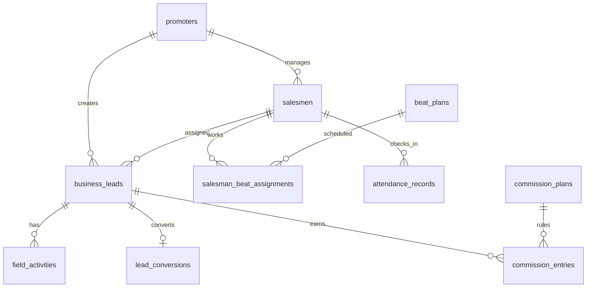
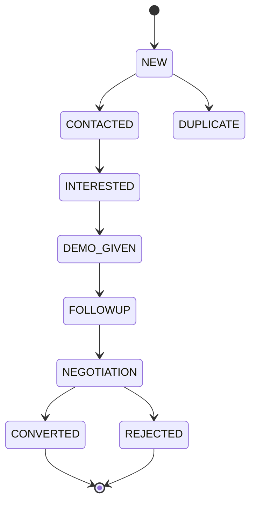
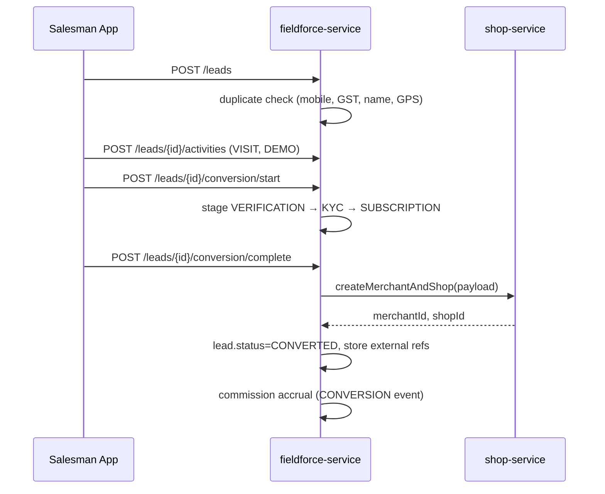

# SugamFlow Field Force — Lead → Conversion Architecture

Enterprise CRM-style field force module inside **fieldforce-service**. Replaces fake `shop_registrations` (prospect pollution) with a proper **Lead → Conversion** pipeline; real merchants/shops are created only after conversion via **shop-service** APIs.

**User & dashboard guides (promoter/salesman):**

- English: [FIELDFORCE-SALESMAN-PROMOTER-GUIDE.md](./FIELDFORCE-SALESMAN-PROMOTER-GUIDE.md) · [PDF](./fieldforce-guides/FIELDFORCE-Salesman-Promoter-Guide-English.pdf)
- Hindi: [FIELDFORCE-SALESMAN-PROMOTER-GUIDE-Hindi.md](./FIELDFORCE-SALESMAN-PROMOTER-GUIDE-Hindi.md) · [PDF](./fieldforce-guides/FIELDFORCE-Salesman-Promoter-Guide-Hindi.pdf)

---

## 1. Problem statement

| Anti-pattern (legacy) | Enterprise approach (this design) |
|----------------------|-----------------------------------|
| Create shop rows for prospects | `business_leads` lightweight prospects |
| Pollutes customer DB & analytics | Conversion creates `external_shop_id` once |
| Duplicate shops | Duplicate detection before lead create |
| Mixed funnel metrics | Dedicated lead funnel & conversion stages |

Legacy `/api/v1/shop-registrations` remains for backward compatibility but is **deprecated**; new clients must use `/api/v1/leads`.

---

## 2. Bounded context

```
┌─────────────────────────────────────────────────────────────────┐
│                     fieldforce-service                          │
│  Promoters │ Salesmen │ Leads │ Activities │ Beats │ Attendance │
│  Targets   │ GPS logs │ Conversion pipeline │ Commissions       │
└───────────────────────────┬─────────────────────────────────────┘
                            │ HTTP (on CONVERTED only)
                            ▼
              ┌─────────────────────────────┐
              │ shop-service / user-service │
              │ Merchant + Shop creation    │
              └─────────────────────────────┘
```

**fieldforce-service NEVER inserts into shop/customer tables.**

---

## 3. Package structure

```
com.shopmanagement.fieldforceservice
├── FieldforceServiceApplication
├── api
│   ├── FieldforceApi.java              # legacy + shared DTOs
│   └── FieldforceLeadApi.java          # leads, activities, beats, conversion
├── model
│   ├── base/TenantAuditableEntity.java
│   ├── BusinessLead, FieldActivity, BeatPlan, ...
│   └── *Status / *Type enums
├── repository
├── service
│   ├── lead/ BusinessLeadService, DuplicateLeadDetectionService
│   ├── activity/ FieldActivityService
│   ├── beat/ BeatPlanService
│   ├── attendance/ AttendanceService
│   ├── conversion/ LeadConversionService
│   └── analytics/ FieldforceAnalyticsService
├── integration
│   └── ShopConversionClient (+ StubShopConversionClient)
├── web
├── filter, exception, support
```

---

## 4. Entity relationship (core)



---

## 5. Lead lifecycle



**Statuses:** `NEW`, `CONTACTED`, `INTERESTED`, `DEMO_GIVEN`, `FOLLOWUP`, `NEGOTIATION`, `CONVERTED`, `REJECTED`, `DUPLICATE`

---

## 6. Conversion pipeline



**Conversion stages:** `VERIFICATION`, `KYC`, `SUBSCRIPTION_SELECTION`, `MERCHANT_CREATION`, `SHOP_CREATION`, `COMPLETED`, `FAILED`

---

## 7. Database schema (V2)

See `fieldforce-service/src/main/resources/db/migration/V2__lead_pipeline.sql`.

| Table | Purpose |
|-------|---------|
| `business_leads` | Prospects (no shop FK) |
| `field_activities` | Visits, calls, demos, follow-ups |
| `beat_plans` | Named routes (e.g. Karol Bagh) |
| `salesman_beat_assignments` | Recurring weekday beats |
| `attendance_records` | Check-in/out + GPS |
| `gps_location_logs` | Live trail / visit validation |
| `performance_targets` | Monthly promoter/salesman targets |
| `lead_conversions` | Pipeline state + external IDs |
| `commission_plans` | + event trigger columns (V2 alter) |
| `commission_entries` | + `business_lead_id`, nullable `shop_registration_id` |

**Indexing:** tenant + status, tenant + mobile, tenant + assigned_salesman, GIN/trigram on `business_name` (future), `(tenant_id, activity_at DESC)` on activities.

**Partitioning (future):** `field_activities` and `gps_location_logs` by `activity_at` / `recorded_at` monthly (PostgreSQL declarative partitions).

**Soft delete:** `deleted_at` on leads, activities, beats (nullable = active).

---

## 8. REST API contracts (v1)

Base: `/api/v1` — headers: `X-Tenant-Id` (required), `X-Request-Id` (optional).

### Leads

| Method | Path | Description |
|--------|------|-------------|
| POST | `/leads` | Create lead (+ duplicate check) |
| PUT | `/leads/{id}` | Update |
| PATCH | `/leads/{id}/status` | Pipeline status |
| GET | `/leads/{id}` | Detail |
| GET | `/leads` | Search/filter/page |
| POST | `/leads/duplicate-check` | Pre-flight duplicates |
| DELETE | `/leads/{id}` | Soft delete |

**Create example:**

```json
POST /api/v1/leads
{
  "businessName": "Sharma General Store",
  "ownerName": "R. Sharma",
  "mobile": "9876543210",
  "businessType": "RETAIL",
  "address": "Karol Bagh",
  "city": "Delhi",
  "state": "DL",
  "pincode": "110005",
  "gpsLatitude": 28.6512,
  "gpsLongitude": 77.1909,
  "leadSource": "FIELD_VISIT",
  "createdByPromoterId": 1,
  "assignedSalesmanId": 3,
  "priority": "HIGH",
  "expectedConversionDate": "2026-06-01"
}
```

### Activities

| Method | Path |
|--------|------|
| POST | `/leads/{leadId}/activities` |
| GET | `/leads/{leadId}/activities` |
| GET | `/activities` (tenant-wide filter) |

### Beats

| Method | Path |
|--------|------|
| POST/PUT/GET | `/beats` |
| POST/DELETE | `/beats/{beatId}/assignments` |

### Attendance

| Method | Path |
|--------|------|
| POST | `/attendance/check-in` |
| POST | `/attendance/check-out` |
| GET | `/attendance` |

### Conversion

| Method | Path |
|--------|------|
| POST | `/leads/{id}/conversion` | Start/update stage |
| POST | `/leads/{id}/conversion/complete` | Finalize → shop-service |
| GET | `/leads/{id}/conversion` |

### Analytics

| Method | Path |
|--------|------|
| GET | `/fieldforce/analytics/funnel` |
| GET | `/fieldforce/analytics/performance` |

### Deprecated

| Method | Path |
|--------|------|
| * | `/shop-registrations` | Use leads + conversion |

---

## 9. Duplicate detection

Before insert:

1. **Mobile** — normalized 10-digit match within tenant (active leads).
2. **GSTIN** — exact match if provided.
3. **Business name** — case-insensitive contains / similarity score threshold.
4. **GPS** — Haversine distance &lt; 100m to existing lead with same mobile prefix or similar name.

Returns `DuplicateCheckResult` with `hasDuplicates`, `candidates[]`, recommended action (`PROCEED`, `MARK_DUPLICATE`, `MERGE`).

---

## 10. Commission engine

| Event | Trigger |
|-------|---------|
| `LEAD_CREATED` | Optional plan rule |
| `DEMO_COMPLETED` | Activity type `DEMO` |
| `CONVERSION` | `lead_conversions.stage=COMPLETED` |
| `LEGACY_SHOP_APPROVAL` | Deprecated shop-reg approval |

`commission_entries.business_lead_id` links ledger to prospect; `shop_registration_id` nullable for new accruals.

---

## 11. Event flow (async — future)

```
LeadCreated → Kafka topic fieldforce.lead.created
LeadConverted → fieldforce.lead.converted → billing/analytics
ActivityLogged → fieldforce.activity.logged → heatmap ETL
```

Phase 1: synchronous HTTP. Phase 2: Spring Cloud Stream outbox.

**shop-service endpoint (implemented):** `POST /api/v1/internal/fieldforce/conversions` with `X-Tenant-Id`. Creates a real `shops` row with id `FF-{leadCode}` and does **not** mirror to deprecated `shop_registrations`. Enable fieldforce client with `FIELDFORCE_SHOP_INTEGRATION_ENABLED=true`.

---

## 12. Security recommendations

- Enforce JWT at **API Gateway**; propagate `X-Tenant-Id` from token claims (never trust client-only).
- Role matrix: `FIELD_FORCE_ADMIN`, `PROMOTER`, `SALESMAN` — row-level filter by `promoterId` / `salesmanId`.
- PII encryption at rest for `mobile`, `gstin` (pgcrypto / app-level).
- Rate-limit lead creation per salesman/day.
- Audit `created_by_user_id` on leads and conversions.

---

## 13. Scalability

- Read replicas for analytics queries.
- Cache promoter/salesman hierarchy in Redis.
- Partition high-volume `field_activities` / `gps_location_logs`.
- S3 pre-signed URLs for activity photos (store URL only in DB).
- Bulk export via read-model CQRS (optional).

---

## 14. Future extensibility

- Geo-fencing rules engine (PostGIS).
- ML lead scoring.
- WhatsApp follow-up integration.
- Beat optimization (VRP).
- Multi-level promoter hierarchy.
- Contract / subscription SKU selection in conversion payload.

---

## 15. Migration from fake shops

1. Deploy V2 migration.
2. Stop creating new `shop_registrations` from mobile apps.
3. Backfill script: map historical `shop_registrations` → `business_leads` + `lead_conversions` where `external_shop_id` is synthetic.
4. Retire shop-reg endpoints after UI cutover.
