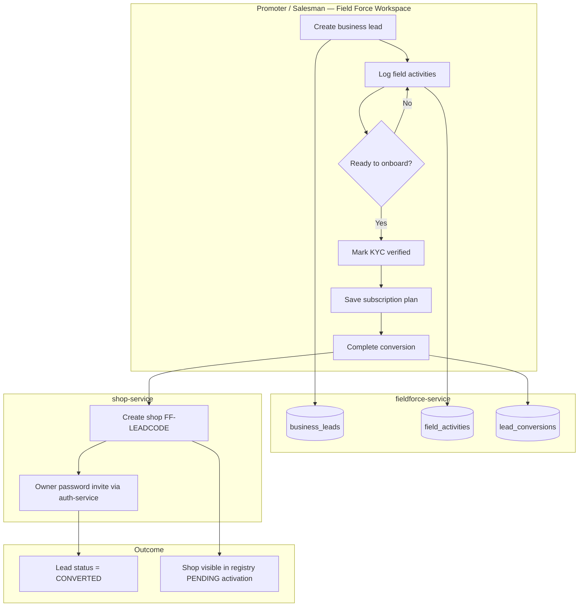
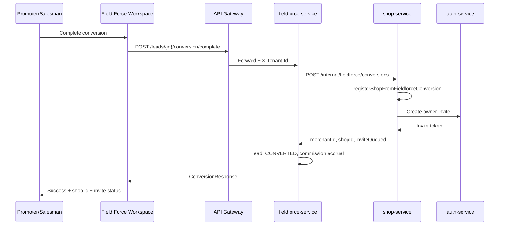

# SugamFlow Field Force — Flow & Salesman/Promoter Dashboard Guide

This document explains the **Lead → Conversion** process for business promoters and salesmen, how the **Field Force Workspace** dashboard works after the update, and how it differs from the old “fake shop registration” flow.

For technical architecture, see [FIELDFORCE-LEAD-ARCHITECTURE.md](./FIELDFORCE-LEAD-ARCHITECTURE.md).

**Other formats**

| Format | File |
|--------|------|
| Hindi (Markdown) | [FIELDFORCE-SALESMAN-PROMOTER-GUIDE-Hindi.md](./FIELDFORCE-SALESMAN-PROMOTER-GUIDE-Hindi.md) |
| PDF (English) | [fieldforce-guides/FIELDFORCE-Salesman-Promoter-Guide-English.pdf](./fieldforce-guides/FIELDFORCE-Salesman-Promoter-Guide-English.pdf) |
| PDF (Hindi) | [fieldforce-guides/FIELDFORCE-Salesman-Promoter-Guide-Hindi.pdf](./fieldforce-guides/FIELDFORCE-Salesman-Promoter-Guide-Hindi.pdf) |

Generate PDFs: from `docs/` run `npm install` then `npm run pdf:fieldforce:all`.

**Daily work + database table reference:** [sugamflow-docs/docs/FIELDFORCE-DAILY-WORK-AND-DATA-REFERENCE.md](../sugamflow-docs/docs/FIELDFORCE-DAILY-WORK-AND-DATA-REFERENCE.md)

---

## 1. Who uses what

| Role | Login role (JWT) | Landing page | Primary job |
|------|------------------|--------------|-------------|
| **Business promoter** | `FIELD_FORCE_PROMOTER` | `/field-force/workspace` | Owns territory; creates leads; may convert high-value prospects |
| **Salesman** | `FIELD_FORCE_SALESMAN` | `/field-force/workspace` | Works under a promoter; creates leads assigned to self |
| **Super admin** | `SUPER_ADMIN` | Platform / field-force admin | Manages promoters, salesmen, commission plans (separate screen) |

Promoter and salesman accounts must include **`promoterId`** or **`salesmanId`** in the auth login response (from `auth_account`). Without that id, the workspace shows an error and cannot attribute leads.

---

## 2. Old flow vs new flow (why the dashboard changed)

### Before (deprecated)

```
Field visit → Enter "External shop ID" + shop name in workspace
           → Saved as shop_registrations (looked like a real shop)
           → Polluted shop/customer data and reports
```

**Dashboard showed:** Tenant shops, pending shop approval, shop registration form.

### After (current)

```
Field visit → Save BUSINESS LEAD (prospect only)
           → Log activities (visit, demo, follow-up, …)
           → Conversion pipeline (KYC → subscription → complete)
           → REAL shop created in shop-service + owner invite email
```

**Dashboard shows:** Lead counts, converted leads, activities, lead list, activity log, conversion panel.

| Topic | Old | New |
|-------|-----|-----|
| Prospect storage | `shop_registrations` | `business_leads` |
| Real shop creation | At registration time (wrong) | Only on **Complete conversion** |
| Duplicate control | Weak | Mobile / GST / name / GPS checks |
| Commission triggers | Shop approval | Lead created, demo, conversion |
| UI entry | “New shop registration” | “New business lead” |

Legacy **shop registrations** API still exists for old data only. **Do not use it for new prospects.**

---

## 3. End-to-end business flow



### Lead statuses (pipeline)

| Status | Meaning |
|--------|---------|
| `NEW` | Just created |
| `CONTACTED` | Visit/call logged |
| `INTERESTED` | Engagement progressing |
| `DEMO_GIVEN` | Demo activity recorded |
| `FOLLOWUP` | Follow-up scheduled/done |
| `NEGOTIATION` | Subscription stage |
| `CONVERTED` | Shop created; closed won |
| `REJECTED` | Lost |
| `DUPLICATE` | Marked duplicate |

Statuses can advance automatically when certain activities are logged (e.g. `DEMO` → `DEMO_GIVEN`).

### Conversion stages (technical)

| Stage | When |
|-------|------|
| `VERIFICATION` | Conversion started |
| `KYC` | KYC marked verified |
| `SUBSCRIPTION_SELECTION` | Plan saved |
| `MERCHANT_CREATION` / `SHOP_CREATION` | During complete |
| `COMPLETED` | Shop + invite succeeded |
| `FAILED` | Shop-service or invite error |

---

## 4. Salesman / promoter dashboard — layout and metrics

**URL:** `/field-force/workspace`  
**Component:** `shop-management-ui` → `FieldForceWorkspaceComponent`  
**API:** `GET /api/v1/fieldforce/analytics/dashboard` (extended summary)

### 4.1 Top summary cards

| Card | Source field | Meaning |
|------|--------------|---------|
| **Leads** | `leads` | Total active business leads for tenant |
| **Converted** | `leadsConverted` | Leads that reached `CONVERTED` |
| **Activities** | `activitiesThisMonth` | Field activities logged (tenant-wide count) |
| **Legacy shop regs** | `shopsLegacy` | Old `shop_registrations` count (historical) |

### 4.2 Left column — create & list

1. **New business lead** — form: business name, mobile (required), owner, city, state, etc.
2. **My leads** — clickable list filtered by role:
   - **Salesman:** only leads where `assignedSalesmanId` = your id
   - **Promoter:** only leads where `createdByPromoterId` = your id

### 4.3 Right column — selected lead detail

Appears when you **click a lead** in the list.

| Section | Actions |
|---------|---------|
| **Lead header** | Code (`LD-123`), status badge, shop id if converted |
| **Log field activity** | Type, notes, next follow-up date → **Log activity** |
| **Activity history** | Chronological list for this lead |
| **Conversion pipeline** | Subscription, KYC checkbox, owner username/email, **Mark KYC**, **Save subscription**, **Complete conversion** |

---

## 5. Step-by-step — salesman / promoter daily use

### Step 1 — Log in

1. Use invite/login with role `FIELD_FORCE_SALESMAN` or `FIELD_FORCE_PROMOTER`.
2. After login you are redirected to **Field force workspace** (not the shop POS).

### Step 2 — Create a prospect (lead)

1. Fill **Business name** and **Mobile** (required).
2. Click **Save lead**.
3. System checks duplicates (same mobile, similar name, etc.). If duplicate, you get an error — use a different record or resolve offline.
4. New lead appears in **My leads** with status `NEW` and code `LD-{id}`.

**Attribution:**

- Salesman → `assignedSalesmanId` set; promoter auto-linked from salesman’s manager.
- Promoter → `createdByPromoterId` set.

### Step 3 — Work the lead (activities)

1. Click the lead in the list.
2. Choose activity type: `VISIT`, `CALL`, `DEMO`, `FOLLOWUP`, etc.
3. Add notes and optional **Next follow-up** date.
4. Click **Log activity**.
5. Lead status may update (e.g. after `DEMO` → `DEMO_GIVEN`).

### Step 4 — Convert to real customer (when ready)

1. With the same lead selected, open **Conversion pipeline**.
2. Confirm **Subscription plan** (e.g. `MONTHLY`, `YEARLY`).
3. Check **KYC verified** (or click **Mark KYC**).
4. Click **Save subscription** (updates conversion stage).
5. Enter **Owner username** and **Owner email** (prefilled; shop owner will receive password setup link).
6. Click **Complete conversion**.

**On success:**

- Lead status → `CONVERTED`
- Shop id shown (e.g. `FF-LD-42`) — real row in **shop-service**
- Message indicates if **owner invite email** was queued
- Commission may accrue per active commission plan (`CONVERSION` event)

**Shop status:** New shops start as `PENDING` until super admin activates (same as public registration).

### Step 5 — Refresh

Click **Refresh** to reload summary cards and lead list.

---

## 6. Promoter vs salesman — differences

| Capability | Promoter | Salesman |
|------------|----------|----------|
| See leads | Created by self (`createdByPromoterId`) | Assigned to self (`assignedSalesmanId`) |
| Create lead | Yes | Yes |
| Log activities | Yes | Yes |
| Complete conversion | Yes | Yes |
| Manage other salesmen’s leads in workspace | No (only own list filter) | No |
| Super admin: create salesman under promoter | Via admin UI | N/A |

Hierarchy is enforced in **fieldforce-service** when a salesman is on the lead: promoter is derived from `salesman.promoter_id` if needed for commission.

---

## 7. Super admin dashboard (unchanged scope, different data)

**Screen:** Super Admin → Field Force (`SuperAdminFieldforceComponent`)

Super admin still manages:

- Promoters & territories  
- Salesmen  
- Commission plans  
- Commission entries  
- Legacy shop registrations (read-only / historical)

**Recommended admin follow-up (not in field workspace):**

- Use analytics API `GET /api/v1/fieldforce/analytics/funnel` for tenant funnel
- Approve/activate converted shops in shop registry (`PENDING` → active)
- Optionally add UI for lead approval — today conversion is driven from field workspace

---

## 8. API map (gateway → fieldforce-service)

All field-force UI calls use header **`X-Tenant-Id`** (and `X-Skip-Tenant-Context: true` from admin service).

| User action | Method | Path |
|-------------|--------|------|
| Dashboard cards | GET | `/api/v1/fieldforce/analytics/dashboard` |
| List my leads | GET | `/api/v1/leads?promoterId=` or `?salesmanId=` |
| Create lead | POST | `/api/v1/leads` |
| List activities | GET | `/api/v1/leads/{id}/activities` |
| Log activity | POST | `/api/v1/leads/{id}/activities` |
| Get conversion | GET | `/api/v1/leads/{id}/conversion` |
| Update conversion | POST | `/api/v1/leads/{id}/conversion` |
| Complete conversion | POST | `/api/v1/leads/{id}/conversion/complete` |

**Complete conversion** triggers **shop-service**:

`POST /api/v1/internal/fieldforce/conversions` → creates shop + owner invite.

---

## 9. Sequence — complete conversion



---

## 10. Configuration required (ops)

| Item | Purpose |
|------|---------|
| Flyway **V2** on `fieldforcedb` | Lead tables |
| `fieldforce-service` running (port 8090) | APIs |
| Gateway route `/api/v1/leads/**`, `/api/v1/fieldforce/**` | UI access |
| `FIELDFORCE_SHOP_INTEGRATION_ENABLED=true` | Real shop on conversion |
| `FIELDFORCE_SHOP_INTEGRATION_BASE_URL=http://shop-service:8080` | Shop client |
| `shop.integration.auth-*` on shop-service | Owner invite |
| Auth accounts with `promoterId` / `salesmanId` | Attribution |

Local Docker: see `docker-compose.yml` `fieldforce-service` environment block.

---

## 11. Commission (how dashboard work ties to pay)

When commission plans include amounts for:

| Event | When it fires |
|-------|----------------|
| `LEAD_CREATED` | Lead saved |
| `DEMO_COMPLETED` | Activity type `DEMO` logged |
| `CONVERSION` | Conversion completed |

Ledger: `commission_entries` with `business_lead_id` (not fake shop registration).

---

## 12. Troubleshooting

| Symptom | Likely cause |
|---------|----------------|
| “Missing promoter/salesman id” | Login account not linked in auth DB |
| “Duplicate lead” on save | Same mobile or nearby GPS/name match |
| Dashboard empty / error | fieldforce-service down or gateway route missing |
| Conversion fails | shop-service down or `FIELDFORCE_SHOP_INTEGRATION_ENABLED=false` |
| Shop created but no email | auth-service URL/key; invite still may be created |
| Lead list empty | Wrong role filter; lead created under another promoter/salesman |

---

## 13. Files reference (implementation)

| Area | Path |
|------|------|
| Field user UI | `shop-management-ui/src/app/components/field-force-workspace/` |
| API client | `shop-management-ui/src/app/services/fieldforce-admin.service.ts` |
| Post-login route | `auth-session.service.ts` → `getPostLoginPath()` → `/field-force/workspace` |
| Backend | `fieldforce-service` — `BusinessLeadController`, `FieldActivityController`, `LeadConversionController` |
| Shop creation | `shop-service` — `FieldforceInternalConversionController` |
| Architecture | `docs/FIELDFORCE-LEAD-ARCHITECTURE.md` |

---

## 14. Quick reference card (printable)

**In the app:** Field Force Workspace → **Print quick reference** (opens a clean A4 page; allow pop-ups if blocked).

**Do not** use browser Ctrl+P on the full dashboard — the app shell can print as a tiny strip. Use the print buttons or open `docs/fieldforce-guides/print-quick-reference.html`.

```
┌─────────────────────────────────────────────────────────────┐
│  FIELD FORCE WORKSPACE — QUICK STEPS                        │
├─────────────────────────────────────────────────────────────┤
│  1. Save lead (prospect) — NOT a shop                        │
│  2. Select lead → Log VISIT / DEMO / FOLLOWUP                 │
│  3. KYC + subscription → Complete conversion                  │
│  4. Owner gets invite email → shop activates after admin      │
│                                                             │
│  Do NOT use "shop registration" for new prospects.           │
└─────────────────────────────────────────────────────────────┘
```

---

*Document version: aligns with Lead → Conversion MVP (fieldforce V2 + workspace UI with activities and conversion).*
