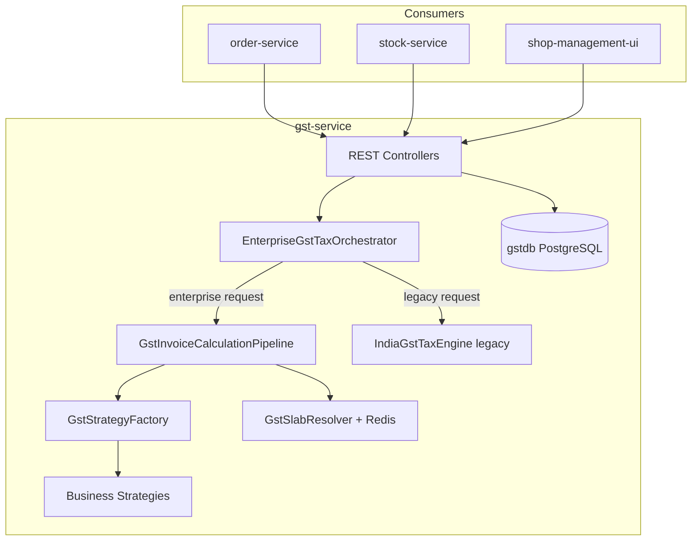

# SugamFlow Enterprise GST Engine — Implementation Guide

**Service:** `gst-service` (port 8091)  
**API base:** `/api/v1/gst/**` via gateway  
**Status:** Production-ready Phase 1 engine (calculation + masters + audit + GSTR staging)

---

## Architecture



### Design patterns

| Pattern | Usage |
|---------|--------|
| **Strategy** | `RetailGstStrategy`, `RestaurantGstStrategy`, `MedicalGstStrategy`, `DistributorGstStrategy`, `ManufacturingGstStrategy` |
| **Factory** | `GstStrategyFactory` selects strategy by `businessType` |
| **Pipeline** | `GstInvoiceCalculationPipeline` — 9-step industry calculation sequence |
| **Facade** | `EnterpriseGstTaxOrchestrator` — backward compatible with order-service |

---

## Calculation sequence (9 steps)

1. Item price × quantity  
2. Line discount  
3. Scheme / free quantity adjustment  
4. Taxable amount  
5. GST type (CGST+SGST / IGST / exempt / reverse charge)  
6. Apply GST % (inclusive or exclusive)  
7. Invoice-level discount  
8. Round-off to nearest rupee  
9. Final payable (`grandTotal`)

---

## API contracts

| Method | Path | Purpose |
|--------|------|---------|
| POST | `/api/v1/gst/tax/calculate` | Full tax calculation |
| POST | `/api/v1/gst/tax/preview` | Preview before save |
| POST | `/api/v1/gst/tax/breakdown` | CGST/SGST/IGST breakup |
| POST | `/api/v1/gst/validate` | GSTIN + state + HSN validation |
| POST | `/api/v1/gst/gstin/validate` | GSTIN format check |
| GET | `/api/v1/gst/hsn/search?q=` | HSN/SAC search |
| GET | `/api/v1/gst/masters/slabs/{code}` | Cached slab lookup |
| GET | `/api/v1/gst/masters/states` | State master |
| POST | `/api/v1/gst/compliance/gstr-summary` | GSTR-1/3B dataset from snapshots |
| POST | `/api/v1/gst/documents/post` | Immutable tax snapshot |

**Headers:** `X-Tenant-Id` (required), `Authorization: Bearer` (via gateway), `X-Request-Id` (optional)

### Sample: retail inclusive POS

```json
POST /api/v1/gst/tax/preview
{
  "applyGst": true,
  "sellerStateCode": "29",
  "customerStateCode": "29",
  "businessType": "RETAIL",
  "pricingMode": "INCLUSIVE",
  "lines": [
    { "lineNo": 1, "quantity": 2, "unitPrice": 118, "gstPercent": 18, "hsnSac": "30049099" }
  ]
}
```

### Sample: restaurant dine-in 5%

```json
{
  "applyGst": true,
  "sellerStateCode": "27",
  "customerStateCode": "27",
  "businessType": "RESTAURANT",
  "pricingMode": "INCLUSIVE",
  "businessAttributes": { "serviceMode": "DINE_IN" },
  "lines": [{ "lineNo": 1, "quantity": 1, "unitPrice": 210, "taxInclusive": true }]
}
```

---

## Database tables (V3 migration)

| Table | Purpose |
|-------|---------|
| `gst_slab_master` | Configurable GST slabs (5%, 12%, 18%, restaurant rates) |
| `state_code_master` | Indian state codes |
| `gst_tax_category` | Product tax categories |
| `tax_master` | Tenant tax codes linked to slabs/HSN |
| `customer_tax_profile` | Buyer GST type (registered, composition, SEZ, export) |
| `supplier_tax_profile` | Supplier RCM flags |
| `tax_rule_engine` | JSON rules (restaurant dine-in, etc.) |
| `invoice_tax_details` | E-invoice / e-way / GSTR extensions per snapshot |
| `invoice_item_tax` | Line-level rate split metadata |
| `gst_transaction_log` | Audit trail (tamper-evident hashes) |

---

## Integration checklist

1. Set `GST_INTEGRATION_ENABLED=true` on `order-service` in production.  
2. Map shop `businessType` → `businessType` on tax API from UI/order layer.  
3. **Done:** Order form calls `GstService.previewTax()` (debounced) when the shop has GST enabled — Summary shows CGST/SGST/IGST and inclusive/exclusive toggle.  
4. Enable Redis: `APP_CACHE_REDIS_ENABLED=true` for slab/HSN cache.  
5. Post snapshots after order/invoice commit via existing `GstTaxServiceClient`.

---

## Security & audit

- Tax amounts are computed server-side only; clients send prices, not tax splits.  
- Every calculation writes `gst_transaction_log` with SHA-256 request hash.  
- Snapshots are immutable; reversals via credit note API.  
- Role-based override: future `tax.override` permission on gateway (Phase 2).

---

## Future scalability

| Phase | Item |
|-------|------|
| 2 | E-invoice NIC adapter, ITC ledger, GSTR-2B reconciliation |
| 3 | Kafka events `tax.document.posted` for async GSTR workers |
| 4 | stock-service purchase WebClient + ITC auto-posting |
| 5 | Rule engine admin UI + CSV HSN import |

---

## Tests

```bash
cd gst-service && mvn test
```

Key suites: `IndiaGstTaxEngineTest`, `EnterpriseGstTaxEngineTest`, `GstTaxApiIntegrationTest`.
