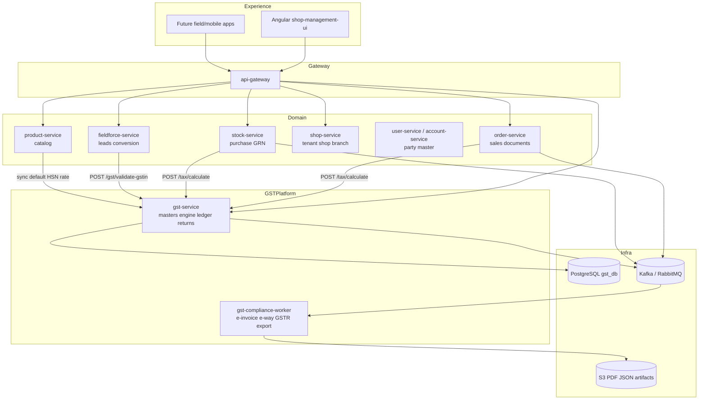
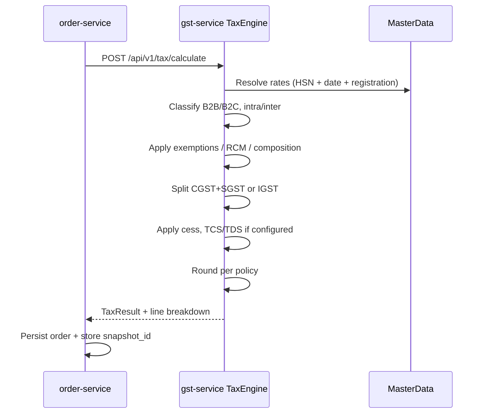
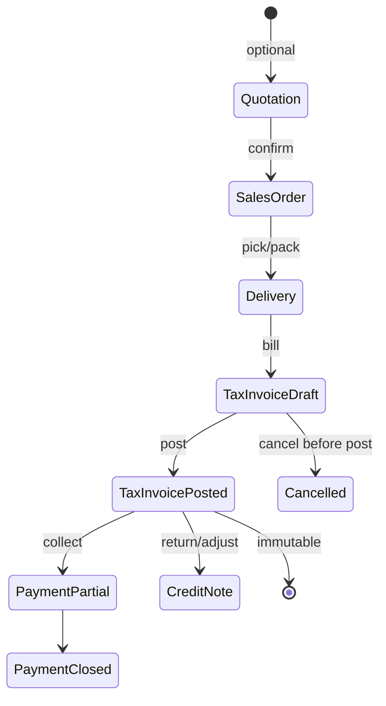
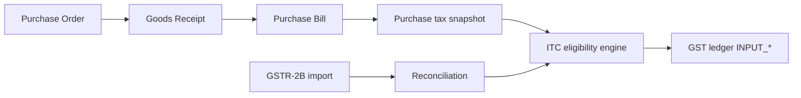
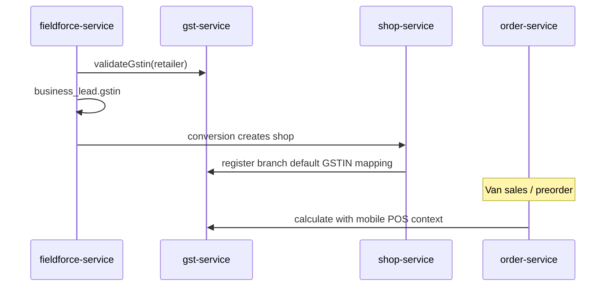

# SugamFlow — Enterprise GST Platform Architecture

**Audience:** Architects, backend leads, compliance/product owners  
**Scope:** Complete GST compliance system for Indian SME / distribution / retail / field sales  
**Status:** Target architecture (May 2026) — maps from **current partial implementation** to enterprise parity (Zoho Books / Tally / Marg / Bizom-class)

**Related:** [PURCHASE-MANAGEMENT-PLAN.md](./PURCHASE-MANAGEMENT-PLAN.md), [SUGAMFLOW-vs-TRADITIONAL-BILLING-SOFTWARE.md](./SUGAMFLOW-vs-TRADITIONAL-BILLING-SOFTWARE.md), [FIELDFORCE-LEAD-ARCHITECTURE.md](./FIELDFORCE-LEAD-ARCHITECTURE.md)

---

## 1. Executive summary

### 1.1 Recommendation: **Option A — dedicated `gst-service` (with phased rollout)**

| Criterion | Option A: `gst-service` | Option B: GST only in `order-service` |
|-----------|-------------------------|--------------------------------------|
| **Enterprise fit** | Strong — single tax brain, audit, versioning | Weak — tax logic spreads to purchase, transfers, credit notes |
| **Multi-state / multi-GSTIN** | Natural tenant → registration → branch mapping | Becomes duplicated across services |
| **ITC + GSTR + e-invoice** | Isolated compliance boundary + NIC adapters | Order DB becomes compliance monolith |
| **Field force + distributor** | Shared validation API (GSTIN, place of supply) | Re-implement in each consumer |
| **Maintainability** | One team owns rates, rules, snapshots | High regression risk on every billing change |
| **Scalability** | Scale calculation & filing workers independently | Order hot path carries filing load |
| **Time to first value** | Slightly slower (new service) | Faster for POS-only GST |

**Verdict:** Build **`gst-service`** as the **system of record for tax configuration, calculation, snapshots, ledger postings, and return datasets**. Keep **transaction orchestration** (order, GRN, delivery) in domain services; they call `gst-service` and store **immutable tax snapshots** on documents.

**Not a separate `billing-service` today:** SugamFlow uses **`order-service`** (POS/orders/invoices) + **`stock-service`** (purchases/suppliers). Architecture below uses actual service names.

### 1.2 Current state (as implemented)

| Area | Maturity | Where |
|------|----------|--------|
| Shop GSTIN + state | Done | `shop-service` — `gst_enabled`, `gst_number`, `gst_state_code`, validation |
| Product GST % + HSN snapshot | Partial | `product-service` — `gst_percent`, `hsn_sac`; patch SQL in `infra/postgres/` |
| POS order tax | Partial | `order-service` — `GstTaxCalculator`, `applyTaxDetails()`, line inclusive/exclusive, CGST/SGST/IGST split |
| Sales invoice tax columns | Schema | `order-service` — `sales_invoices` CGST/SGST/IGST |
| Purchase GST / ITC | Planned | `stock-service`, [PURCHASE-MANAGEMENT-PLAN.md](./PURCHASE-MANAGEMENT-PLAN.md) |
| E-invoice / GSTR / ITC reconciliation | Not started | — |
| Central HSN master / rate versioning | Not started | — |
| Field GSTIN on leads | Partial | `fieldforce-service` — lead/promoter `gstin`, duplicate checks |
| Event bus for tax | Not started | — |

**Gap:** Tax rules live in **order-service** as procedural code; no **immutable statutory snapshot**, no **HSN-driven rates**, no **ITC ledger**, no **return buckets**.

---

## 2. How enterprise ERPs manage GST (reference model)

Patterns from **Zoho Books**, **Tally Prime**, **SAP India GST**, **Marg/Busy**, **Bizom/BeatRoute**:

| Layer | Responsibility |
|-------|----------------|
| **Master** | GST registrations per legal entity, branches, HSN/SAC, tax rates with effective dates, exemptions, RCM rules |
| **Transaction** | Quote → SO → Delivery → **Taxable invoice** (immutable) → Payment |
| **Engine** | Deterministic calculation: place of supply, B2B/B2C, intra/inter-state, composition, export |
| **Snapshot** | Line-level tax frozen at invoice time (rates, HSN, splits, round-off) |
| **Ledger** | Output tax, input tax, ITC available/blocked, RCM payable |
| **Compliance** | GSTR-1/2/2B/3B datasets, e-invoice IRN, e-way bill |
| **Audit** | Who changed rate, who cancelled invoice, hash chain / seq gaps |

SugamFlow should mirror this **layering**, not a single “add 18% in order service” function.

---

## 3. Target microservice map



### 3.1 Service boundaries

| Service | Owns | Must NOT own |
|---------|------|----------------|
| **gst-service** | Registrations, HSN/SAC, rates, rules, calculation API, tax snapshots, GST ledger, return staging, audit | Stock qty, payments settlement, CRM pipeline |
| **order-service** | Orders, invoices, credit notes, numbering per shop, payment status | Rate tables, GSTR file formats |
| **stock-service** | PO, GRN, supplier, inward qty | ITC rules engine (calls gst-service) |
| **product-service** | SKU, barcode, default `hsn_sac` + suggested rate id | Effective rate history |
| **shop-service** | Shop profile, branch, **link to default gst_registration_id** | Tax computation |
| **fieldforce-service** | Leads, conversion | Long-term GST master |

---

## 4. Core domain model (`gst-service`)

### 4.1 GST master

```text
gst_registration
  id, tenant_id, legal_name, gstin (unique per tenant), state_code,
  registration_type (REGULAR, COMPOSITION, SEZ, ISD, TDS_TCS...),
  effective_from, effective_to, status, created_at, updated_at

gst_registration_branch_map
  tenant_id, branch_id, shop_id, warehouse_id, gst_registration_id, is_default

tax_region
  id, code, name, country, state_code, union_territory_flag

gst_tax_category
  id, code, name, supply_type (GOODS, SERVICES), default_hsn_sac_id

hsn_sac_master
  id, code (4/6/8 digit), description, chapter, type (HSN|SAC), active

gst_rate_schedule
  id, hsn_sac_id OR tax_category_id, gst_rate_percent, cess_percent,
  effective_from, effective_to, version, source (GOVT_SCHEDULE|CUSTOM)

gst_tax_rule
  id, priority, name, condition_json, action_json, effective_from, effective_to
  -- e.g. RCM, exempt, zero-rated, e-commerce operator

exemption_rule
  id, registration_id, hsn_sac_id, reason, effective_dates

reverse_charge_rule
  id, supplier_type, hsn_sac_id, rcm_percent, notification_ref
```

**Versioning:** Never UPDATE rate in place for past invoices; close row `effective_to`, insert new row. Calculation always uses **`transaction_date`** + **`place_of_supply`**.

### 4.2 Transaction snapshots (immutable)

```text
tax_document_snapshot
  id, tenant_id, source_service, source_type, source_id, source_number,
  document_type (TAX_INVOICE, BILL_OF_SUPPLY, DEBIT_NOTE, CREDIT_NOTE, PURCHASE, STOCK_TRANSFER),
  document_date, place_of_supply_state,
  seller_gst_registration_id, buyer_gstin, buyer_state_code,
  supply_type (B2B, B2C, EXPORT, SEZ...),
  subtotal, discount, taxable_value, total_tax, cess, tcs, tds, round_off, grand_total,
  tax_summary_json, -- CGST/SGST/IGST totals
  snapshot_hash, created_at, created_by

tax_line_snapshot
  id, tax_document_snapshot_id, line_no,
  product_id, description, hsn_sac, qty, uom,
  unit_price, discount, taxable_value,
  gst_rate, cgst_rate, sgst_rate, igst_rate, cess_rate,
  cgst_amount, sgst_amount, igst_amount, cess_amount,
  tax_inclusive_flag, rate_schedule_version_id
```

**Rule:** After `POSTED` / `INVOICED`, snapshots are **append-only**. Corrections via **credit/debit note** new snapshots linked to `original_snapshot_id`.

### 4.3 GST ledger (compliance accounting)

```text
gst_ledger_entry
  id, tenant_id, gst_registration_id, period_yyyymm,
  entry_type (OUTPUT_CGST, OUTPUT_SGST, OUTPUT_IGST, INPUT_CGST, ITC_CLAIMED, ITC_REVERSED, RCM...),
  tax_document_snapshot_id, amount, posted_at

itc_eligibility
  id, purchase_snapshot_id, eligible_percent, blocked_reason (17_5, GSTR2B_MISMATCH...)

gstr2b_reconciliation
  id, period, vendor_gstin, invoice_ref, books_amount, portal_amount, status
```

### 4.4 E-invoice / e-way (staging)

```text
einvoice_request
  id, tax_document_snapshot_id, nic_provider, status (PENDING, IRN_GENERATED, FAILED),
  irn, ack_no, ack_date, signed_qr_payload, error_code, retry_count

eway_bill_request
  id, tax_document_snapshot_id, distance_km, vehicle_no, transporter_id, ewb_no, valid_upto
```

---

## 5. Tax engine design

### 5.1 Principles

1. **Pure function:** `TaxContext + Line[] → TaxResult` (no side effects).
2. **Deterministic** for same inputs (audit replay).
3. **Explainable:** return `applied_rules[]` per line for UI and audit.
4. **Pluggable strategies:** India GST first; interface allows future VAT.

### 5.2 TaxContext (input)

```json
{
  "tenantId": 101,
  "transactionDate": "2026-05-19",
  "documentType": "TAX_INVOICE",
  "seller": {
    "gstRegistrationId": 12,
    "gstin": "29AABCU9603R1ZM",
    "stateCode": "29",
    "registrationType": "REGULAR"
  },
  "buyer": {
    "gstin": "27AAAAA0000A1Z5",
    "stateCode": "27",
    "b2c": false
  },
  "placeOfSupplyState": "27",
  "lines": [
    {
      "lineNo": 1,
      "productId": 501,
      "hsnSac": "30049099",
      "quantity": 10,
      "unitPrice": 118.0,
      "priceInclusiveOfTax": true,
      "discountAmount": 0,
      "overrideGstRate": null
    }
  ],
  "headerDiscount": 0,
  "roundOffStrategy": "LINE_THEN_HEADER_HALF_UP"
}
```

### 5.3 Computation pipeline



### 5.4 India GST rules (must implement in phases)

| Rule | Logic |
|------|--------|
| **Intra-state** | CGST + SGST (50/50 of GST) |
| **Inter-state** | IGST 100% |
| **B2C local** | Same as intra; optional composition |
| **B2B** | Buyer GSTIN; POS from buyer state or shipping address policy |
| **Export** | Zero-rated / LUT; no ITC reversal in engine (flag only) |
| **RCM** | Buyer pays GST; ITC eligibility separate posting |
| **Composition** | Flat rate; no ITC on purchases (blocked in ITC module) |
| **Exempt / nil** | 0% with reason code |
| **Mixed invoice** | Line-level first, then header totals |

**Rounding (recommend):** taxable and tax per line to 2 decimals (HALF_UP); header = sum(lines); document round-off line ±0.01–0.05 if needed (Tally-style).

### 5.5 Relation to current `GstTaxCalculator`

Today `order-service` uses a **simplified** calculator (default 18%, header tax, basic IGST split). **Migration path:**

1. Extract logic into `gst-service` as `IndiaGstStrategyV1`.
2. `order-service` calls HTTP/gRPC; fallback circuit breaker to legacy calculator during rollout.
3. Delete embedded calculator after parity tests.

---

## 6. Document lifecycle (invoice flow)



| Stage | GST action |
|-------|----------------|
| Quotation | Preview tax (`calculate` dry-run) |
| Sales order | Optional accrual only (no statutory invoice) |
| Delivery | No tax posting (qty event) |
| **Tax invoice** | **Create `tax_document_snapshot`**, assign invoice number, trigger e-invoice if applicable |
| Payment | No tax change (unless TDS/TCS on receipt configured) |
| Credit note | New snapshot with negative amounts; link original IRN |

**Invoice numbering:** Per `gst_registration` + FY + series (e.g. `INV/25-26/000123`). `order-service` holds counter; `gst-service` validates gap-free audit.

---

## 7. Purchase & ITC



| Step | Owner |
|------|--------|
| Supplier GSTIN validation | `gst-service` (NIC/public API cache) |
| Purchase bill tax | `stock-service` calls `calculate` with `documentType=PURCHASE` |
| ITC available | `gst-service` rules (blocked 17(5), personal, etc.) |
| 2B match | `gst-compliance-worker` compares portal vs `tax_document_snapshot` |

---

## 8. Multi-state & multi-GSTIN

```text
Tenant (legal group)
  └── gst_registration (KA GSTIN)
  └── gst_registration (MH GSTIN)
        └── branch_map → shop/warehouse
```

**Place of supply:** Config per tenant: `SHIPPING_ADDRESS` | `BUYER_BILLING` | `SELLER_DISPATCH` (default for B2B: dispatch from seller branch state).

**Stock transfer:** `documentType=STOCK_TRANSFER` — may trigger e-way; tax often zero-rated between same GSTIN; different GSTIN = taxable supply (branch transfer rules).

---

## 9. Field force + GST



| Touchpoint | Behavior |
|------------|----------|
| Lead capture | Optional GSTIN; duplicate check (already on lead) |
| Conversion | Copy GSTIN to `shop-service`; validate active status |
| Van sale | Offline queue: store `TaxContext` hash; sync snapshot on reconnect |
| Retailer master | `user-service` party `gstin`, `state_code`, `composition_flag` |

---

## 10. Event-driven architecture

### 10.1 Topics (Kafka recommended at scale)

| Event | Producer | Consumers |
|-------|----------|-----------|
| `tax.document.posted` | order/stock | gst-ledger, einvoice-worker, analytics |
| `tax.document.cancelled` | order | einvoice-cancel, audit |
| `gst.itc.mismatch` | gst-service | notification-service |
| `gstr.period.closed` | gst-service | reporting-service |
| `payment.received` | payment-service | TCS/TDS optional |

### 10.2 Consistency

- **Sync:** `calculate` + `validate` on user path (&lt; 200ms p95).
- **Async:** IRN generation, GSTR JSON build, 2B import.
- **Outbox pattern** in `order-service` / `gst-service` for at-least-once delivery.

---

## 11. API contracts (`gst-service`)

Base path: `/api/v1/gst` (gateway route dedicated).

| Method | Path | Purpose |
|--------|------|---------|
| POST | `/registrations` | CRUD GSTIN registrations |
| GET | `/registrations?tenantId=` | List |
| POST | `/hsn/search?q=` | HSN/SAC typeahead |
| POST | `/rates/resolve` | Rate for HSN + date |
| POST | `/tax/calculate` | Full engine |
| POST | `/tax/preview` | Dry-run (quotation) |
| POST | `/gstin/validate` | Format + optional live status |
| POST | `/snapshots` | Persist snapshot (internal) |
| GET | `/snapshots/{id}` | Audit read |
| GET | `/reports/liability?period=` | GSTR-3B summary |
| GET | `/reports/itc?period=` | ITC summary |
| POST | `/returns/gstr1/export` | Generate JSON |
| POST | `/einvoice/generate` | Queue IRN |
| GET | `/einvoice/{id}/status` | Poll IRN |

### 11.1 Example: `POST /tax/calculate`

**Request:** (see TaxContext above)

**Response:**

```json
{
  "snapshotDraftId": "draft-8f2a",
  "supplyType": "B2B",
  "interState": true,
  "taxableValue": 1000.00,
  "cgst": 0,
  "sgst": 0,
  "igst": 180.00,
  "cess": 0,
  "roundOff": 0,
  "grandTotal": 1180.00,
  "lines": [
    {
      "lineNo": 1,
      "hsnSac": "30049099",
      "gstRate": 18,
      "taxableValue": 1000.00,
      "igst": 180.00,
      "appliedRules": ["HSN_RATE_V12", "INTER_STATE_IGST"]
    }
  ]
}
```

---

## 12. Database strategy (PostgreSQL)

| DB | Contents |
|----|----------|
| **gst_db** | All master, snapshots, ledger, compliance staging |
| order_db | `tax_snapshot_id` FK reference only (no rate logic) |
| stock_db | `purchase_tax_snapshot_id` |

**Indexing:**

- `tax_document_snapshot (tenant_id, document_date DESC)`
- `tax_line_snapshot (tax_document_snapshot_id)`
- `gst_rate_schedule (hsn_sac_id, effective_from, effective_to)`
- `gst_ledger_entry (tenant_id, gst_registration_id, period_yyyymm)`

**Partitioning (scale):**

- `tax_document_snapshot` by `document_date` RANGE monthly
- `gst_ledger_entry` by `period_yyyymm`

**Immutability:** RLS + revoke UPDATE on snapshot tables; corrections via new rows.

---

## 13. Security & compliance

| Control | Implementation |
|---------|----------------|
| Audit log | `gst_audit_event` — who, when, old/new JSON |
| Tamper evidence | `snapshot_hash` = SHA-256(canonical JSON) |
| Role access | `GST_ADMIN`, `GST_VIEW`, `BILLING` scopes in JWT |
| NIC credentials | Secrets manager; per `gst_registration` |
| Digital signature | Phase 2 — sign PDF at invoice post |
| Data retention | 8+ years India; archive to S3 Glacier |

---

## 14. Analytics dashboards

| Dashboard | Metrics |
|-----------|---------|
| Liability | Output tax by period, net payable |
| ITC | Available, claimed, blocked, lapsed |
| State-wise | IGST vs CGST/SGST mix |
| Branch-wise | Per `gst_registration` |
| HSN-wise | Top taxable supplies |
| Filing calendar | GSTR-1/3B due dates, status |

**Source:** `gst_db` materialized views refreshed on `tax.document.posted`.

---

## 15. Package structure (`gst-service`)

```text
com.sugamflow.gst
  ├── api          (controllers, DTOs)
  ├── domain       (entities, enums)
  ├── engine
  │     ├── TaxEngineFacade
  │     ├── india   (IntraState, InterState, Rcm, Composition)
  │     └── rules   (RuleChain, RuleRepository)
  ├── master       (registration, hsn, rates)
  ├── snapshot     (immutable store)
  ├── ledger       (posting, ITC)
  ├── compliance   (gstr, einvoice adapters)
  ├── integration  (NIC client, outbox)
  └── audit
```

---

## 16. Implementation roadmap (phased)

### Phase 0 — Foundation (4–6 weeks)

- [x] Create `gst-service` + `gst_db` + Flyway (`V1__init_gst.sql`)
- [x] GST registration CRUD + HSN search + GSTIN validate APIs
- [x] Rate schedule table + seed HSN rows
- [x] `POST /api/v1/gst/tax/calculate` (India engine, POS parity)
- [x] Wire `order-service` → `gst-service` (`GST_INTEGRATION_ENABLED`, default `false`)
- [ ] Branch map API + admin UI
- [ ] Full gov HSN CSV import

### Phase 1 — Statutory snapshots (4–6 weeks)

- [x] `tax_document_snapshot` on invoice post (`POST /api/v1/gst/documents/post`; order POS → `SALES_RECEIPT`)
- [x] Credit note snapshots (`POST /api/v1/gst/documents/credit-note`)
- [x] Invoice series per GSTIN + FY (`POST /api/v1/gst/invoices/next-number`, auto on `TAX_INVOICE` post)
- [x] Branch ↔ shop ↔ GSTIN mapping (`POST/GET /api/v1/gst/branches/map`)
- [ ] Migrate product default rate → `rate_schedule_id` (deferred to product-service)

### Phase 2 — Purchase & ITC (6–8 weeks)

- [ ] Purchase bill tax in `stock-service`
- [ ] ITC eligibility + ledger
- [ ] GSTR-2B import + mismatch report

### Phase 3 — Compliance automation (8–12 weeks)

- [ ] E-invoice IRN (NIC GSP)
- [ ] E-way bill
- [ ] GSTR-1 / 3B export JSON
- [ ] Async workers + retry DLQ

### Phase 4 — Field & distribution (6 weeks)

- [ ] GSTIN validation API for fieldforce
- [ ] Van sales offline tax hash sync
- [ ] Distributor B2B price lists with tax preview

### Phase 5 — Enterprise (ongoing)

- [ ] TCS/TDS on sales
- [ ] Multi-currency export
- [ ] Advanced analytics + BI connector

---

## 17. Mobile & offline strategy

1. **Download** tax rate bundle (HSN → rate) per tenant daily.
2. **Offline invoice:** store `TaxContext` + `TaxResult` locally; server reconciles snapshot on sync.
3. **Conflict:** server wins on rate version; flag invoice for review if rate changed.

---

## 18. Performance targets

| Operation | Target p95 |
|-----------|------------|
| `/tax/calculate` (10 lines) | &lt; 150 ms |
| `/gstin/validate` (cached) | &lt; 80 ms |
| IRN generation | async &lt; 60 s |
| GSTR export (10k lines) | async &lt; 5 min |

**Cache:** Redis for active rate schedules + GSTIN validation (24h TTL).

---

## 19. Testing strategy

- **Golden files:** 500+ scenarios (intra/inter, RCM, exempt, mixed basket).
- **Regression:** Compare legacy `GstTaxCalculator` vs engine during Phase 0.
- **Property tests:** totals = sum(lines) ± round-off.
- **Compliance:** Sandbox NIC for e-invoice.

---

## 20. Decision log

| ID | Decision | Rationale |
|----|----------|-----------|
| ADR-GST-001 | Dedicated `gst-service` | Enterprise scope beyond POS |
| ADR-GST-002 | Immutable snapshots | Statutory audit |
| ADR-GST-003 | Kafka for compliance | Retryable IRN/GSTR |
| ADR-GST-004 | Keep orders in order-service | Bounded context unchanged |
| ADR-GST-005 | PostgreSQL per service | Aligns with current stack |

---

## 21. Appendix — mapping current SugamFlow fields

| Current | Target |
|---------|--------|
| `shop.gst_*` | `gst_registration` + shop branch map |
| `product.gst_percent` | `gst_rate_schedule` + default on product |
| `product.hsn_sac` | `hsn_sac_master` reference |
| `order.cgst/sgst/igst` | From `tax_document_snapshot` |
| `GstTaxCalculator` | `gst-service` engine |
| Lead `gstin` | Validated via `POST /gstin/validate` |

---

*Document version: 1.0 — May 2026. Review quarterly or when CBIC rate notifications change.*
