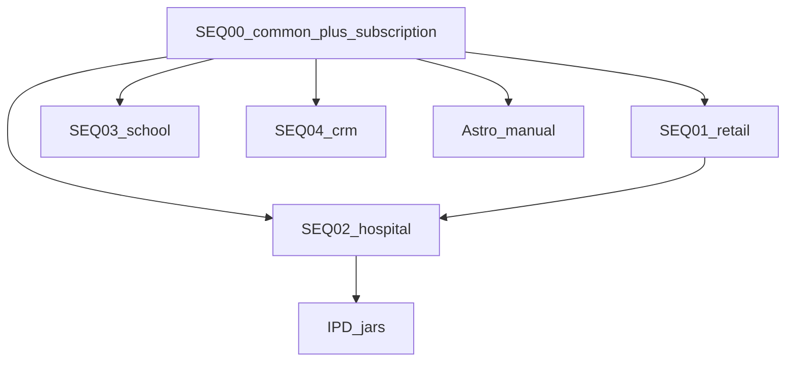

# SugamFlow — start every app (local)

One runbook for Retail, Hospital/Polyclinic, School, CRM, Astro, and IPD.

**Roots**

| Repo | Path |
|------|------|
| Platform / compose / sequences | `D:\sugamFlow` |
| School ERP + **subscription-service** jar | `D:\school` |
| CRM | `D:\sugamFlow\crm-service`, `D:\sugamFlow\crm-ui` |
| Astro | `D:\sugamFlow\sugamflow-astro` (not `D:\sugamFlow\jyotish-service`) |

**Prereqs:** Docker Desktop engine healthy (`docker info` works). Host Postgres `:5432`. See [DOCKER-CLEAN.md](DOCKER-CLEAN.md) if the engine is 500 / pipe missing.

**Observability (optional):** Grafana/Loki/Tempo/Prometheus + OTel collector — [OBSERVABILITY.md](../observability/OBSERVABILITY.md). Does not replace SEQ 00.

```powershell
docker compose -f D:\sugamFlow\observability\docker-compose.observability.yml up -d
```

**Rule:** Run **SEQ 00 once per session**. Do not start a second Eureka on `:8761`.

**After Docker Desktop crashes or is restarted:** SEQ 00 comes back (login works) but **product/stock stay Exited (255)**. Product List then shows “Something went wrong.” Always run **SEQ 01** again (or `start-sugamflow-app.ps1`). Do not stop at SEQ 00.

---

## Are your commands correct?

Almost. Corrections:

| You had | Do this instead |
|---------|-----------------|
| SEQ 00, then 01, then 02 | Correct for Retail + Hospital |
| Second SEQ 00 with `-ExposeSchoolPorts` for School | **Do not re-run SEQ 00.** Flag is a no-op. Just run `03-school-erp.ps1 -WithUi` |
| Separate `cd D:\school ... -Only subscription-service` after SEQ 00 | **Not needed** if SEQ 00 succeeded. SEQ 00 already starts `:8182` |
| `pull-stack-images` + `start-common-platform` + `start-sugamflow-app` | Valid **legacy** Retail path. `start-common-platform` already starts subscription |
| `start-docker-clean` first | Optional. SEQ 00 / `start-common-platform` already call it |

**subscription-service** is **not** a Docker image. Do not add it to `pull-stack-images.ps1` or SEQ 01/02. It is a **host JAR** from `D:\school`, started by SEQ 00.

---

## Layer model

```text
SEQ 00  Common + subscription :8182     shared by all apps
SEQ 01  Retail (product/stock/order/…)
SEQ 02  Hospital / Polyclinic (doctor/appointment/queue)
SEQ 03  School ERP jars + UI :4300
SEQ 04  CRM API :8095 + UI :4500
Astro   jyotish-service :8097 + UI :4600   (no SEQ script yet)
IPD     ipd :8100 + accommodation :8101     (on top of 00+01+02)
```



---

## 1. Common platform (always first)

```powershell
cd D:\sugamFlow
.\scripts\sequences\00-common-platform.ps1 -SkipMailHog
```

Equivalent (same script underneath):

```powershell
cd D:\sugamFlow
.\scripts\start-docker-clean.ps1          # optional; SEQ 00 already does this
.\scripts\pull-stack-images.ps1 -SkipMail # only if images are missing
.\scripts\start-common-platform.ps1 -SkipMailHog
```

What SEQ 00 starts:

| Piece | Port | How |
|-------|------|-----|
| Postgres | 5432 | Windows service |
| Redis | 6379 | Docker |
| Config | 8888 | Docker |
| Eureka | 8761 | Docker |
| Gateway | **9090** | Docker |
| Auth / shop / user / notification / account | 8085 / 8080 / 8084 / 8087 / 8089 | Docker |
| **subscription-service** | **8182** | Host JAR via `D:\school\scripts\start-services.ps1 -Only subscription-service -AdvertiseIp host.docker.internal` |

Opt out: `-SkipSubscription`.

If `:8182` is down after SEQ 00:

```powershell
cd D:\school
.\scripts\start-services.ps1 -Only subscription-service -AdvertiseIp host.docker.internal
```

Logs: `D:\school\logs\services\subscription-service.err.log`

Gateway route: `/api/subscription` → `host.docker.internal:8182` (Super Admin → Platform Subscription).

---

## 2. Pick the app(s)

Run only what you need. Common must already be up.

### Retail

```powershell
cd D:\sugamFlow
.\scripts\sequences\01-sugamflow-retail.ps1 -WithUi
```

Legacy equivalent (no clinic):

```powershell
.\scripts\start-sugamflow-app.ps1
# UI: cd D:\sugamFlow\shop-management-ui ; npx ng serve --port 4200
```

| | |
|--|--|
| UI | http://localhost:4200 |
| Demo | `RET-DEMO-01` / `demo` / `Demo@2026` |

### Hospital / Polyclinic

Needs Retail POS/stock (SEQ 01) as well.

```powershell
cd D:\sugamFlow
.\scripts\sequences\01-sugamflow-retail.ps1
.\scripts\sequences\02-hospital-polyclinic.ps1 -WithUi
```

| | |
|--|--|
| UI | http://localhost:4200 (shop UI, **not** school :4300) |
| Demo | `POLY-DEMO-01` or `TRUST-POLY-01` / `demo` / `Demo@2026` |
| Ports | Doctor 8092, Appointment 8093, Queue 8098 |

### School ERP

```powershell
cd D:\sugamFlow
.\scripts\sequences\03-school-erp.ps1 -WithUi
```

Do **not** run SEQ 00 a second time. SEQ 03 starts all school jars (`:8181`–`:8202`); subscription `:8182` is skipped if already bound.

One-shot from school repo (optional SEQ 00 inside):

```powershell
cd D:\school
.\scripts\start-school-sequence.ps1 -StartCommon -WithUi
```

| | |
|--|--|
| School UI | http://localhost:4300 |
| Demo | `demo-school` / `admin` / `password` |

Jar-only common (no Docker — do not mix with Docker Eureka):

```powershell
cd D:\school
.\scripts\start-platform.ps1 -SugamFlowRoot "D:\sugamFlow" -SkipMailHog
.\scripts\start-services.ps1 -AdvertiseIp 127.0.0.1
# then start subscription if start-platform did not:
.\scripts\start-services.ps1 -Only subscription-service -AdvertiseIp 127.0.0.1
```

### CRM

```powershell
cd D:\sugamFlow

# Pilot (entitlements off)
.\scripts\sequences\04-crm.ps1 -WithUi

# Real FEATURE_CRM (needs SEQ 00 + plan assigned in Super Admin)
.\scripts\sequences\00-common-platform.ps1 -SkipMailHog
.\scripts\sequences\04-crm.ps1 -RequireEntitlement -WithUi
```

| | |
|--|--|
| UI | http://localhost:4500 |
| API | http://localhost:8095 |
| Demo | Tenant `CRM-DEMO-01` / `demo` / `Demo@2026` |

CRM compose profile `crm` is for EC2, not this local SEQ.

### Astro (Jyotish)

No sequence script. After SEQ 00 if you want gateway / subscription URLs:

```powershell
# DB once
psql -U postgres -h localhost -f D:\sugamFlow\sugamflow-astro\jyotish-service\scripts\create-jyotishdb.sql

cd D:\sugamFlow\sugamflow-astro\jyotish-service
mvn spring-boot:run "-Dspring-boot.run.profiles=local"

cd D:\sugamFlow\sugamflow-astro\jyotish-ui
npm start
```

| | |
|--|--|
| UI | http://localhost:4600 |
| API | http://localhost:8097 |
| Login | auth-service (shop + username + password); tenant from session |

Optional Docker: compose profile `jyotish` (`JYOTISH_SUBSCRIPTION_BASE_URL=http://host.docker.internal:8182`). Do not use `D:\sugamFlow\jyotish-service` (stub).

### IPD (on Hospital)

```powershell
cd D:\sugamFlow
.\scripts\restart-ipd-billing-local.ps1 -SkipBuild
```

Ports: IPD `:8100`, accommodation `:8101`. UI routes under shop `:4200`.

---

## 3. Full desk (all verticals)

```powershell
cd D:\sugamFlow
.\scripts\sequences\00-common-platform.ps1 -SkipMailHog
.\scripts\sequences\01-sugamflow-retail.ps1
.\scripts\sequences\02-hospital-polyclinic.ps1
.\scripts\sequences\03-school-erp.ps1 -WithUi
.\scripts\sequences\04-crm.ps1 -WithUi
# Astro: Maven + npm as above
```

Login 504 on `:4200`:

```powershell
cd D:\sugamFlow
.\scripts\ensure-login-stack.ps1
```

---

## 4. Script map (what to run vs what not to add)

| Script | Role | Starts subscription :8182? |
|--------|------|----------------------------|
| `scripts\sequences\00-common-platform.ps1` | Preferred SEQ 00 | **Yes (default)** |
| `scripts\start-common-platform.ps1` | Same as SEQ 00 | **Yes** |
| `D:\school\scripts\start-services.ps1 -Only subscription-service` | Manual / fallback | **Yes** |
| `scripts\sequences\03-school-erp.ps1` | All school jars | Yes if port free |
| `scripts\sequences\01-sugamflow-retail.ps1` | Retail | No — uses SEQ 00 |
| `scripts\sequences\02-hospital-polyclinic.ps1` | Clinic | No — uses SEQ 00 |
| `scripts\sequences\04-crm.ps1` | CRM | No — **consumes** `:8182` when `-RequireEntitlement` |
| `scripts\start-sugamflow-app.ps1` | Retail Docker apps | No |
| `scripts\pull-stack-images.ps1` | Pull Docker images | **No** (not an image) |
| `scripts\start-docker-clean.ps1` | Start Docker Desktop | No |
| `start-local.ps1` / `daily-start-sugamflow.ps1` | Legacy full Docker | **No** — prefer SEQ 00 first |

---

## 5. Build (when images/jars are missing)

```powershell
cd D:\sugamFlow
.\scripts\sequences\build-by-sequence.ps1 -Seq 00,01,02
.\scripts\sequences\build-by-sequence.ps1 -Seq 03          # school + subscription jars
.\scripts\sequences\build-by-sequence.ps1 -Seq 04          # crm image
```

SEQ 03 `mvn package` builds `subscription-service` but does **not** start it. Start is SEQ 00.

---

## Ports

| Layer | Ports |
|-------|-------|
| Common | Eureka 8761, Config 8888, Gateway **9090**, Auth 8085, Shop 8080, User 8084, Notify 8087, Account 8089 |
| **Subscription** | **8182** |
| Retail | Product 8081, Stock 8082, Order 8083, Payment 8086, Reporting 8088, FieldForce 8090, GST 8091, Ledger 8094 |
| Clinic | Doctor 8092, Appointment 8093, Queue 8098 |
| IPD | 8100 / 8101 |
| School | 8181–8202, UI 4300 |
| CRM | API 8095, UI 4500 |
| Astro | API 8097, UI 4600 |
| Shop UI | 4200 |

---

## Related

- Engine / prune: [DOCKER-CLEAN.md](DOCKER-CLEAN.md)
- Sequence internals: `D:\sugamFlow\scripts\sequences\README.md`
