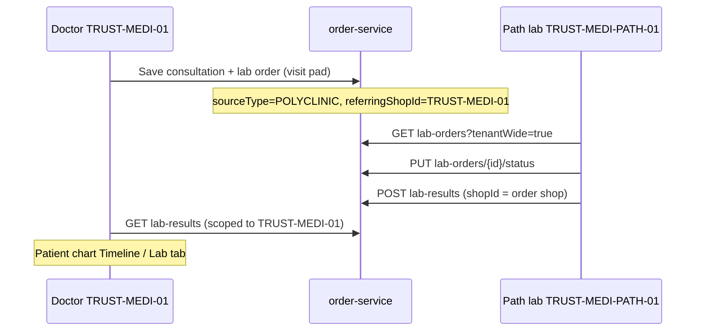

# Path Lab architecture (SugamFlow)

## Business types

- **POLYCLINIC / CLINIC** — OPD, doctor pad, pharmacy; creates `lab_orders` from the visit pad (`consultationId` set, `sourceType` polyclinic).
- **PATH_LAB** — Dedicated pathology UI (`/path-lab/*`), **tenant-wide** lab order APIs so referrals from sibling polyclinic shops appear automatically.

Capability registry: `shop-management-ui/src/app/constants/business-type-capabilities.ts`.

## Integration flow (TRUST-MEDI-01 ↔ TRUST-MEDI-PATH-01)

Both shops share **one tenant** (e.g. tenant `4`). Patients/customers are tenant-wide.

1. **Doctor** (`TRUST-MEDI-01`, Doctor dashboard) — OPD queue → visit pad → **Lab orders** → **Save lab order** → `POST /sales-admin/lab-orders` (linked `consultationId`, `sourceType` `POLYCLINIC`, `referringShopId` `TRUST-MEDI-01`).
2. **Path lab** (`TRUST-MEDI-PATH-01`) — **Sample worklist** / **Reports** use `GET /sales-admin/lab-orders?tenantWide=true` (all tenant referrals).
3. Technician advances status (`PUT /lab-orders/{id}/status`) — `ORDERED` → `SAMPLE_COLLECTED` → `IN_PROCESS` → `REPORTED` → `COMPLETED`.
4. **Reports** → publish (`POST /lab-results`) — result is stored on the **originating lab order’s shop** so the doctor **Patient chart → Lab** tab on `TRUST-MEDI-01` shows `LAB_RESULT` events.

### Product catalogs (two shops)

| Shop | SKU examples | Used by |
|------|----------------|---------|
| `TRUST-MEDI-01` | `LFT-TEST`, `TMEDI-CLAB-*` | Doctor visit pad dropdown |
| `TRUST-MEDI-PATH-01` | `TMEDI-LAB-*`, `TMEDI-PKG-*` | Billing, import, full lab menu |

Lab order line items store **test code + name** from the polyclinic product; path lab matches them operationally to `TMEDI-LAB-*` (same test, different SKU prefix per shop).

Seed both: `.\scripts\seed-path-lab-tests.ps1` (path lab catalog + polyclinic `TMEDI-CLAB-*` rows).

Shared entities: **customers** (patients), **orders/billing**, **products** (test catalog), **notifications** (future), **GST** (`PATH_LAB` → medical GST profile).

## Database (order-service)

- `lab_orders` — status lifecycle, `consultation_id`, `sample_barcode`, `source_type`, `home_collection`, `referring_shop_id` (V15).
- `lab_order_items`, `lab_results`, `lab_result_items` — existing clinical tables.

## UI modules (PATH_LAB)

| Route | Purpose |
|-------|---------|
| `/path-lab` | Dashboard KPIs |
| `/path-lab/worklist` | Sample tracking, status, barcode |
| `/path-lab/booking` | Walk-in / home collection booking |
| `/path-lab/reports` | Publish results for doctors |

Header tab **Path lab** replaces Products/Pharmacy for PATH_LAB shops; Patients use **Users** tab.

## Scalability

Add a business type by extending `CAPABILITIES`, header labels seeder pack, and optional routes — no forked apps.

## Seed scripts & test catalog

| Script / file | Purpose |
|---------------|---------|
| `scripts/seed-path-lab-tests.ps1` | Creates `TRUST-MEDI-PATH-01` (shopdb) + full test catalog (productdb) |
| `infra/postgres/patches/seed-path-lab-standard-tests.sql` | SQL catalog with indicative INR prices (owner edits in UI) |
| `infra/postgres/patches/create-trust-medi-path-lab-shop.sql` | PATH_LAB shop row only |
| `scripts/test-path-lab-integration.ps1` | API smoke test (catalog + tenantWide lab orders) |
| `docs/PATH-LAB-TEST-CATALOG.md` | Human-readable price list |

## Future phases

Barcode printing, PDF reports, digital signature, WhatsApp/SMS critical alerts, reference-doctor CRM, dedicated `reference_doctors` table, HMS inpatient linkage.
