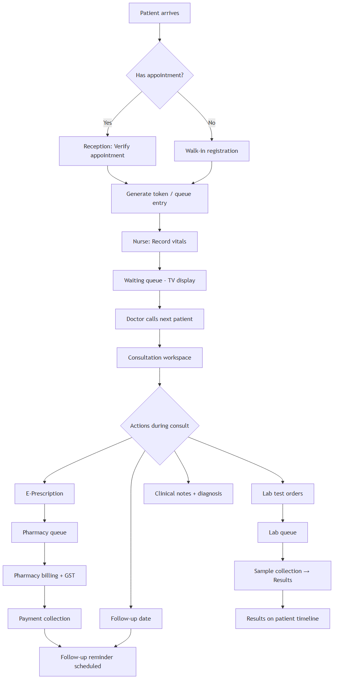
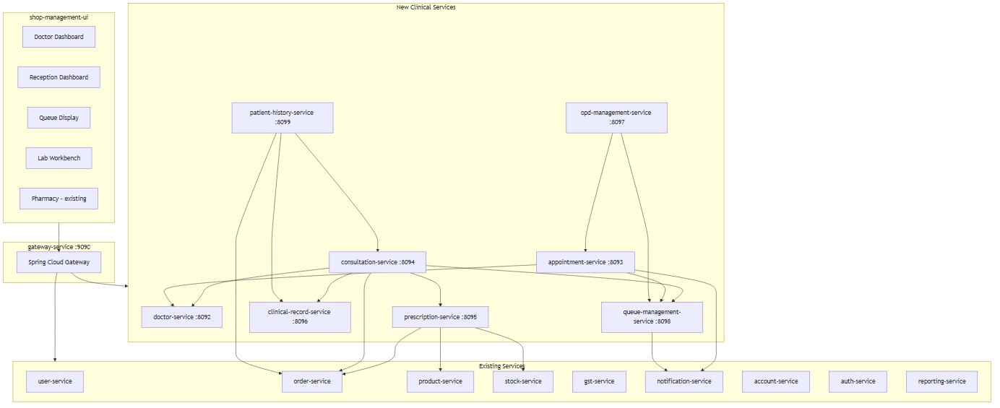
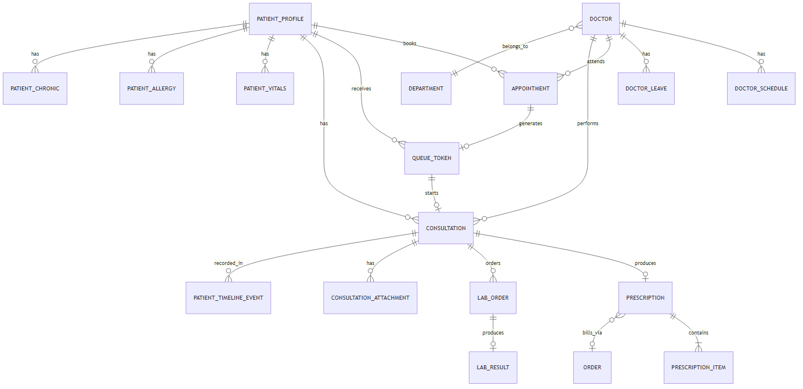
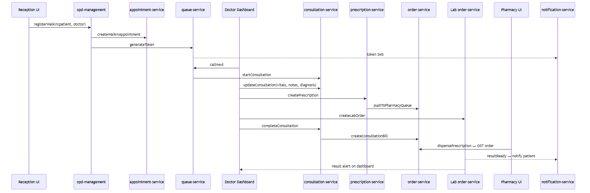

# SugamFlow Polyclinic Management Module
## Technical Implementation Plan

<div class="cover-note">

**Document version:** 1.0  
**Platform:** SugamFlow ERP (Java 17 · Spring Boot 3.5 · Angular 16 · PostgreSQL)  
**Scope:** Enterprise-grade polyclinic management — doctor workflow, consultation lifecycle, EMR, appointments, queue, prescriptions, lab/pharmacy integration  
**Status:** Architecture & implementation plan (pre-coding) · **v1.1** includes Performance Checklist (Section 21)

</div>

<div class="toc">

**Contents**

1. Executive Summary  
2. Current State — What to Reuse  
3. Industry Workflow Reference (Indian Polyclinic)  
4. Target Microservice Architecture  
5. Service Specifications (8 Services)  
6. Entity Relationship Diagram  
7. Event-Driven Communication Design  
8. Role-Based Access Control  
9. Integration with Existing Modules  
10. UI/UX Screen Plan  
11. Smart Features (AI-Assisted)  
12. Reporting & Analytics  
13. Data Migration Strategy  
14. Infrastructure Additions  
15. Implementation Roadmap  
16. Audit & Compliance  
17. Risk & Mitigation  
18. Demo Seed Data Plan  
19. Decision Log  
20. Next Steps  
21. Performance Checklist

</div>

---

## 1. Executive Summary

SugamFlow already supports patient management (as customers), lab management, pharmacy, billing & GST, inventory, notifications, multi-tenant architecture, user roles, and reports. The goal is **not** to rebuild from scratch — it is to add the missing **clinical workflow layer** on top of existing foundations.

| Dimension | Current State | Target State |
|-----------|---------------|--------------|
| Patient model | `CUSTOMER` users in user-service (name, phone, address only) | Full patient profile + UHID + clinical demographics |
| Doctor model | Free-text `doctor_name` on records | First-class doctor registry linked to staff accounts |
| Consultation | Basic CRUD in order-service (`OPEN` status only) | Full lifecycle with vitals, notes, queue integration |
| Appointments | Not implemented | Slot-based booking + walk-in + emergency queue |
| Prescription | Works via `/pharmacy` UI | Doctor workspace e-Rx with templates, alerts, WhatsApp |
| Lab | Backend APIs only, no UI | Doctor orders → lab queue → results on patient timeline |
| Queue/OPD | Header labels only | Live token system with TV display + doctor call-next |
| Roles | SHOP_OWNER / SHOP_EMPLOYEE + 4 clinical permissions | 8 healthcare roles with granular RBAC |
| Events | HTTP-only | Event-driven clinical domain events via RabbitMQ |

**Recommended strategy:** Phased extraction — start with **doctor-service**, **appointment-service**, and **queue-management-service**, extend order-service consultation APIs, then split into the full 8-service target as load grows.

---

## 2. Current State — What to Reuse

### 2.1 Existing Clinical Backend (order-service)

Clinical domain already exists in order-service:

- **Tables:** `consultations`, `prescriptions`, `prescription_items`, `lab_orders`, `lab_order_items`, `lab_results`, `lab_result_items`
- **Migration:** `V5__add_consultation_and_lab_tables.sql`
- **API:** `/api/v1/sales-admin/**` — consultations, prescriptions, lab orders/results
- **UI:** Pharmacy dispense at `/pharmacy` (end-to-end Rx → bill flow)
- **Analytics:** Owner dashboard + Medical AI insights (`/reports/medical-ai`)

| Asset | Reuse Strategy |
|-------|----------------|
| Consultations, prescriptions, lab | Extend in Phase 1; migrate to dedicated services in Phase 3 |
| Prescription items | Keep; add frequency, route, food instructions columns |
| Pharmacy dispense UI | Keep; link to doctor e-Rx |
| Medicine catalog (product-service) | Prescription search source |
| GST billing (gst-service) | OPD/lab/pharmacy billing unchanged |
| Stock/FEFO (stock-service) | Pharmacy stock validation on dispense |
| Patients (user-service) | Extend with PatientProfile |
| Multi-tenant patterns | Copy TenantScopedEntity to all new services |
| Header labels (CONSULTATION/PHARMACY/LAB) | Wire to new UI routes |

### 2.2 Primary Gaps

- Doctor registry, schedule, fees, commission, leave  
- Appointment engine + slot management  
- OPD token queue (live, multi-doctor)  
- Doctor dashboard / consultation workspace UI  
- Patient EMR (vitals, allergies, chronic, timeline)  
- Healthcare roles (Doctor, Nurse, Receptionist, etc.)  
- Consultation lifecycle (update, complete, cancel)  
- E-prescription templates + drug interaction alerts  
- Lab UI workflow  
- Follow-up scheduling + automated reminders  
- Clinical event bus  

---

## 3. Industry Workflow Reference (Indian Polyclinic)

Based on HealthPlix, Practo Ray, MocDoc, CureMD, and typical Indian OPD patterns.

### 3.1 Standard Patient Journey



**Steps:** Patient Registration → Appointment Booking → Token Generation → Waiting Queue → Doctor Consultation → Prescription → Lab Recommendation → Pharmacy Billing → Payment → Follow-up Scheduling.

### 3.2 Doctor Dashboard Pattern (HealthPlix-style)

Doctors work from a **single screen** with three zones:

1. **Left panel** — Today's queue (Scheduled → Waiting → In-consult → Completed)  
2. **Center panel** — Active consultation workspace (patient summary + vitals + notes + Rx builder)  
3. **Right panel** — Patient history timeline (past visits, Rx, labs, allergies)

Minimum clicks: search patient → call next → consult → save Rx → next patient.

### 3.3 Indian Polyclinic Specifics

| Practice | Implementation Need |
|----------|---------------------|
| Token number per doctor per day | QueueToken with daily sequence reset |
| Walk-in majority (~60–70%) | Walk-in creates appointment + token in one step |
| Consultation fee at reception or post-consult | Link to order-service billing |
| Multiple doctors, same reception | Department + doctor filter on queue |
| WhatsApp Rx sharing | notification-service WhatsApp channel |
| Generic medicine names on Rx | Search by MedicineDetail.genericName |
| Lab as in-house or outsourced | Lab orders as products (productType=LAB_TEST) |
| GST on medicines | Existing MedicalGstStrategy |
| UHID / MRN | Generate UHID-{shopPrefix}-{sequence} |

---

## 4. Target Microservice Architecture



### 4.1 New Services

| Service | Port | Database | Purpose |
|---------|------|----------|---------|
| doctor-service | 8092 | doctordb | Doctor registry, departments, schedules, fees, leave |
| appointment-service | 8093 | appointmentdb | Online/walk-in booking, slot management, reminders |
| consultation-service | 8094 | consultationdb | Consultation lifecycle, clinical encounter |
| prescription-service | 8095 | prescriptiondb | E-Rx builder, templates, drug interaction checks |
| clinical-record-service | 8096 | clinicalrecorddb | EMR — vitals, allergies, chronic, vaccinations |
| opd-management-service | 8097 | opddb | OPD session orchestrator (reception workflow) |
| queue-management-service | 8098 | queuedb | Live token queue, WebSocket, TV display |
| patient-history-service | 8099 | patienthistorydb | Unified patient timeline (CQRS read model) |

### 4.2 Phased Service Rollout

| Phase | Services | Duration |
|-------|----------|----------|
| **Phase 1** | doctor-service, appointment-service, queue-management-service + extend order-service | 8–10 weeks |
| **Phase 2** | clinical-record-service, patient-history-service | 6 weeks |
| **Phase 3** | Extract consultation-service, prescription-service from order-service | 6 weeks |
| **Phase 4** | opd-management-service, reporting extensions, IPD foundations | 4 weeks |

---

## 5. Service Specifications

### 5.1 doctor-service (Port 8092)

**Key entities:** departments, doctors (linked to account-service), doctor_schedules, doctor_leaves

**Core API:**

| Method | Path | Description |
|--------|------|-------------|
| GET/POST | `/api/v1/doctors` | List / register doctor from staff account |
| GET/PUT | `/api/v1/doctors/{id}` | Profile / update fees |
| GET/PUT | `/api/v1/doctors/{id}/schedule` | Weekly schedule |
| GET | `/api/v1/doctors/{id}/availability?date=` | Available slots |
| POST | `/api/v1/doctors/{id}/leave` | Mark leave |
| GET/POST | `/api/v1/departments` | Department CRUD |

**Schema highlights:**

```sql
CREATE TABLE doctors (
    id BIGSERIAL PRIMARY KEY,
    tenant_id BIGINT NOT NULL,
    shop_id VARCHAR(100) NOT NULL,
    account_id BIGINT NOT NULL,
    department_id BIGINT REFERENCES departments(id),
    registration_number VARCHAR(100),
    specialization VARCHAR(255),
    consultation_fee DECIMAL(12,2) DEFAULT 0,
    follow_up_fee DECIMAL(12,2) DEFAULT 0,
    commission_percent DECIMAL(5,2) DEFAULT 0,
    status VARCHAR(20) DEFAULT 'ACTIVE'
);
```

### 5.2 appointment-service (Port 8093)

**Statuses:** BOOKED, CONFIRMED, CHECKED_IN, IN_PROGRESS, COMPLETED, CANCELLED, NO_SHOW  
**Types:** SCHEDULED, WALK_IN, EMERGENCY, FOLLOW_UP

| Method | Path | Description |
|--------|------|-------------|
| GET | `/api/v1/appointments/today` | Today's appointments for doctor dashboard |
| POST | `/api/v1/appointments` | Book appointment |
| POST | `/api/v1/appointments/walk-in` | Walk-in (auto-book + queue) |
| PUT | `/api/v1/appointments/{id}/check-in` | Reception check-in → triggers token |
| GET | `/api/v1/appointments/slots?doctorId=&date=` | Available slots |

**Events:** `appointment.booked`, `appointment.checked_in`, `appointment.reminder_due`

### 5.3 queue-management-service (Port 8098)

**Token statuses:** WAITING, CALLED, IN_CONSULTATION, COMPLETED, SKIPPED

| Method | Path | Description |
|--------|------|-------------|
| GET | `/api/v1/queue/today?doctorId=` | Live queue for doctor |
| GET | `/api/v1/queue/display?branchId=` | Public TV display |
| PUT | `/api/v1/queue/tokens/{id}/call` | Doctor calls next |
| PUT | `/api/v1/queue/tokens/{id}/complete` | Done |

**WebSocket:** `/ws/queue/{doctorId}` for real-time updates.

### 5.4 consultation-service (Port 8094)

Migrate from order-service.consultations with enriched schema:

- Structured symptoms/diagnosis (JSONB)  
- Follow-up date, examination findings, advice  
- Status: DRAFT, IN_PROGRESS, COMPLETED, CANCELLED  
- Links: appointment_id, queue_token_id, doctor_id, billing_order_id  

| Method | Path | Description |
|--------|------|-------------|
| POST | `/api/v1/consultations` | Start consultation (from queue) |
| PUT | `/api/v1/consultations/{id}` | Update (autosave) |
| PUT | `/api/v1/consultations/{id}/complete` | Complete + trigger billing |
| GET | `/api/v1/consultations/{id}/suggestions` | AI diagnosis suggestions |

### 5.5 clinical-record-service (Port 8096)

**Entities:** patient_profiles (UHID), patient_vitals, patient_allergies, patient_chronic_conditions, vaccination_records

| Method | Path | Description |
|--------|------|-------------|
| GET/PUT | `/api/v1/patients/{id}/profile` | Clinical profile |
| POST | `/api/v1/patients/{id}/vitals` | Record vitals (nurse) |
| GET/POST | `/api/v1/patients/{id}/allergies` | Allergy CRUD |
| GET | `/api/v1/patients/{id}/alerts` | Active allergy + chronic alerts |

### 5.6 prescription-service (Port 8095)

Extend existing prescriptions with frequency, route, food_instruction, prescription_templates, drug_interactions.

| Method | Path | Description |
|--------|------|-------------|
| POST | `/api/v1/prescriptions/validate` | Drug interaction + allergy check |
| GET | `/api/v1/prescriptions/templates?doctorId=` | Rx templates |
| GET | `/api/v1/prescriptions/{id}/print` | PDF for print |
| POST | `/api/v1/prescriptions/{id}/share` | WhatsApp share |
| GET | `/api/v1/prescriptions/repeat?patientId=` | Repeat last medicines |

### 5.7 patient-history-service (Port 8099)

CQRS read model — `patient_timeline_events` populated from domain events.

| Method | Path | Description |
|--------|------|-------------|
| GET | `/api/v1/patients/{id}/timeline` | Full timeline (paginated) |
| GET | `/api/v1/patients/{id}/timeline/summary` | Quick summary for doctor dashboard |
| GET | `/api/v1/patients/search?q=` | Search by name, phone, UHID |

### 5.8 opd-management-service (Port 8097)

Thin orchestration layer:

| Method | Path | Description |
|--------|------|-------------|
| POST | `/api/v1/opd/register-walk-in` | Patient reg + appointment + token |
| POST | `/api/v1/opd/check-in/{appointmentId}` | Check-in → vitals prompt → queue |
| GET | `/api/v1/opd/dashboard` | Reception dashboard stats |

---

## 6. Entity Relationship Diagram



**Core relationships:** Patient → Appointments → Queue Tokens → Consultations → Prescriptions / Lab Orders → Orders (billing). Doctor belongs to Department. Timeline events aggregate all clinical activity.

---

## 7. Event-Driven Communication Design

### 7.1 Exchange Design

```
Exchange: sugamflow.clinical (topic)

Routing Keys:
  appointment.booked | appointment.checked_in | appointment.cancelled
  queue.token.generated | queue.token.called | queue.token.completed
  consultation.started | consultation.completed
  prescription.created | prescription.dispensed
  lab.order.created | lab.result.ready
  vitals.recorded | followup.scheduled
```

### 7.2 Event Consumers

| Event | Consumers |
|-------|-----------|
| appointment.booked | notification-service, patient-history-service |
| appointment.checked_in | queue-management-service |
| queue.token.generated | notification-service (SMS: "Your token is A-042") |
| consultation.completed | patient-history-service, order-service, reporting-service |
| prescription.created | order-service (pharmacy queue), patient-history-service |
| lab.result.ready | notification-service, patient-history-service, doctor alert |

### 7.3 Event Payload Standard

```json
{
  "eventId": "uuid",
  "eventType": "consultation.completed",
  "timestamp": "2026-05-24T10:30:00+05:30",
  "tenantId": 1,
  "shopId": "MED-03",
  "branchId": 1,
  "payload": {
    "consultationId": 1234,
    "patientId": 567,
    "doctorId": 89
  }
}
```

---

## 8. Role-Based Access Control

### 8.1 Healthcare Roles

| Role | Code | Key Permissions |
|------|------|-----------------|
| Super Admin | SUPER_ADMIN | All (existing) |
| Clinic Admin | CLINIC_ADMIN | All clinic modules, doctor management, reports |
| Receptionist | RECEPTIONIST | Patients, appointments, check-in, queue, billing |
| Doctor | DOCTOR | Own dashboard, consultations, Rx, lab orders, patient history |
| Nurse | NURSE | Vitals, patient profile, queue assist |
| Lab Technician | LAB_TECH | Lab orders, result entry |
| Pharmacist | PHARMACIST | Prescription queue, dispense, stock |
| Billing Staff | BILLING_STAFF | Orders, invoices, payments |

### 8.2 New Permissions (extend staff-permissions.ts)

```
MANAGE_DOCTORS, MANAGE_DEPARTMENTS, MANAGE_APPOINTMENTS, MANAGE_QUEUE,
VIEW_PATIENT_HISTORY, EDIT_PATIENT_PROFILE, RECORD_VITALS,
MANAGE_PRESCRIPTION_TEMPLATES, VIEW_DOCTOR_ANALYTICS, MANAGE_OPD, SHARE_PRESCRIPTION
```

**Doctor data scoping:** Doctors see only their own queue/consultations via `X-Auth-Doctor-Id` JWT claim.

---

## 9. Integration with Existing Modules



| Module | Integration | Changes Needed |
|--------|-------------|----------------|
| user-service | Patients | PatientProfile entity; UHID generation |
| account-service | Staff → Doctor | Doctor registration from account |
| product-service | Medicines + lab tests | productType=LAB_TEST for lab catalog |
| stock-service | Pharmacy stock | Call on prescription validate |
| order-service | Billing, lab, pharmacy | Keep lab tables; consultation fee line item |
| gst-service | Tax | No change; MedicalGstStrategy handles |
| notification-service | Reminders | Templates: appointment, token, Rx, lab result |
| reporting-service | Analytics | New clinic report endpoints |
| gateway-service | Routing | Add routes for 8 new services |

---

## 10. UI/UX Screen Plan

### 10.1 New Angular Routes

| Route | Component | Role | Priority |
|-------|-----------|------|----------|
| `/doctor/dashboard` | DoctorDashboardComponent | Doctor | **P0** |
| `/doctor/consultation/:id` | ConsultationWorkspaceComponent | Doctor | **P0** |
| `/reception/dashboard` | ReceptionDashboardComponent | Receptionist | **P0** |
| `/reception/appointments/book` | AppointmentBookingComponent | Receptionist | **P0** |
| `/queue/display` | QueueDisplayComponent | Public/TV | **P0** |
| `/lab/orders` | LabOrderListComponent | Lab Tech | P1 |
| `/patients/:id/history` | PatientHistoryComponent | Doctor, Nurse | P1 |
| `/clinic/doctors` | DoctorManagementComponent | Clinic Admin | P1 |
| `/pharmacy` | PharmacyDispenseComponent | Pharmacist | **Exists** |

### 10.2 Doctor Dashboard Layout (P0 — Most Important)

Three-panel layout:

- **Left:** Today's queue with Call Next button, avg wait time  
- **Center:** Consultation workspace — chief complaint, symptoms, diagnosis, vitals, e-Rx builder, lab orders, follow-up  
- **Right:** Patient history timeline, allergies, chronic conditions  

**UX principles:** Keyboard shortcuts (Ctrl+Enter call next, Ctrl+S save, Ctrl+K search), autosave every 30s, large fonts for tablet, single-page workflow.

### 10.3 Queue TV Display

Full-screen public display: "Now Serving: A-042 — Dr. Sharma — Room 3" with WebSocket auto-refresh.

---

## 11. Smart Features (AI-Assisted)

| Feature | Implementation | Phase |
|---------|---------------|-------|
| Repeat medicine recommendations | Query last 3 prescriptions | Phase 1 |
| Auto Rx templates | prescription_templates + diagnosis matching | Phase 1 |
| Chronic/allergy alerts | clinical-record-service /alerts | Phase 1 |
| Drug interaction alerts | drug_interactions lookup table | Phase 2 |
| AI diagnosis suggestions | LLM with symptoms + vitals (advisory only) | Phase 3 |
| Follow-up prediction | Historical pattern analysis | Phase 3 |

---

## 12. Reporting & Analytics

| Report | Metrics |
|--------|---------|
| Doctor performance | Patients/day, avg consult time, revenue, repeat rate |
| Department revenue | Revenue by department, consultation count |
| OPD analytics | Peak hours, avg wait time, no-show rate |
| Lab revenue | Tests ordered, turnaround time |
| Pharmacy sales | Rx vs OTC ratio, top medicines |
| Patient retention | New vs repeat, 30/60/90 day return rate |

---

## 13. Data Migration Strategy

| Existing Table | Migration Action |
|----------------|-----------------|
| consultations | Copy to consultationdb; add doctor_id; keep proxy in order-service |
| prescriptions | Copy to prescriptiondb; add new columns |
| lab_orders/results | Keep in order-service Phase 1; migrate Phase 3 |
| doctor_name strings | Create doctor records from staff accounts |

**Backward compatibility:** order-service exposes compatibility layer; existing `/api/v1/sales-admin/consultations` continues working during transition.

---

## 14. Infrastructure Additions

### New PostgreSQL Databases

doctordb, appointmentdb, consultationdb, prescriptiondb, clinicalrecorddb, opddb, queuedb, patienthistorydb

### Docker Compose

Add 8 new services (ports 8092–8099). Enable RabbitMQ for clinical events (remove `queue` profile restriction).

### Service Template

Each service follows existing conventions: Java 17, Spring Boot 3.5, TenantScopedEntity, RequestIdFilter, Flyway, Eureka, Gateway routing, WebClient.

---

## 15. Implementation Roadmap

### Phase 1 — Foundation + Doctor Dashboard MVP (8–10 weeks)

| Weeks | Deliverable |
|-------|-------------|
| 1–2 | doctor-service + appointment-service; DB schemas; gateway routes; healthcare roles |
| 2–3 | queue-management-service; WebSocket; token generation |
| 3–4 | Patient profile; UHID; clinical-record-service vitals + allergies |
| 4–6 | **Doctor Dashboard UI** (queue + consultation workspace + basic Rx) |
| 6–7 | Reception dashboard + appointment booking + check-in |
| 7–8 | Queue TV display; pharmacy integration |
| 8–10 | RabbitMQ events; notification templates; demo seed data |

**Exit criteria:** Walk-in → token → doctor consults → Rx → pharmacy dispenses → bill generated.

### Phase 2 — EMR + Lab + Analytics (6 weeks)

Patient timeline, lab UI, Rx templates, drug interactions, doctor analytics, follow-up reminders.

### Phase 3 — Service Extraction + Scale (6 weeks)

Extract consultation/prescription services; opd-management orchestrator; multi-doctor polyclinic; IPD schema foundations.

### Phase 4 — Smart Features + Hardening (4 weeks)

AI suggestions, WhatsApp Rx sharing, PDF prescriptions, audit logs, load testing.

---

## 16. Audit & Compliance

Every clinical service includes `audit_logs` table tracking CREATE/UPDATE/DELETE/VIEW with actor, old/new values JSONB, IP address. All patient data access logged. 7-year retention policy. No PHI in application logs.

---

## 17. Risk & Mitigation

| Risk | Mitigation |
|------|-----------|
| Over-engineering 8 services upfront | Phased rollout; start with 3 services + extend order-service |
| Breaking pharmacy flow | Compatibility proxy; pharmacy UI unchanged in Phase 1 |
| doctor_name → doctor_id migration | Seed script matching staff accounts |
| RabbitMQ not enabled | Enable in docker-compose; HTTP fallback for critical paths |
| Real-time queue latency | WebSocket + Redis pub/sub cache |

---

## 18. Demo Seed Data Plan

```
sql/polyclinic/
  01-polyclinic-shop-onboard.sql
  02-departments-and-doctors.sql
  03-doctor-schedules.sql
  04-demo-appointments-today.sql
  05-demo-queue-tokens.sql
  06-demo-patient-profiles.sql
  07-demo-consultations-history.sql
  08-prescription-templates.sql
  09-drug-interactions-seed.sql
  10-lab-test-products.sql
```

---

## 19. Decision Log

| Decision | Choice | Rationale |
|----------|--------|-----------|
| 8 services vs monolith | Phased split | Avoid operational overhead early |
| Patient profile location | clinical-record-service | Separate CRM vs clinical data |
| Doctor linked to account | doctor.account_id → account-service | Reuse auth, no duplicate login |
| Queue state | Dedicated service + Redis | Real-time WebSocket requirements |
| Patient timeline | CQRS read model | Avoid N+1 cross-service queries |
| Lab location | order-service Phase 1 | APIs exist; UI is the gap |
| Event bus | RabbitMQ topic exchange | Already in docker-compose |
| IPD | Schema only Phase 3 | Full IPD is Phase 5+ |

---

## 20. Next Steps

1. Scaffold **doctor-service** — departments, doctors, schedules  
2. Scaffold **appointment-service** + **queue-management-service**  
3. Extend patient model — UHID + clinical profile  
4. Build **Doctor Dashboard UI** — highest-value deliverable  
5. Wire **RabbitMQ clinical events**  
6. Build **Reception dashboard** + queue display  

Each step includes Flyway migrations, gateway routes, Angular service clients, and demo seed SQL — following existing SugamFlow conventions.

---

## 21. Performance Checklist

Polyclinic integration does **not** inherently slow SugamFlow, but it amplifies existing bottlenecks if implemented naively. Use this checklist before and during rollout.

### 21.1 Verdict Summary

| Question | Answer |
|----------|--------|
| Is polyclinic integration inherently slow? | **No** |
| Are there performance risks? | **Yes — mainly unpaginated queries and microservice chatter** |
| Will it affect non-clinic shops? | **No**, if gated by `businessType` |
| Biggest hot spot? | **Doctor dashboard + live queue** |
| First code fix (Phase 0) | **Indexed, date-filtered clinical queries in order-service** |

### 21.2 Performance Budget (Target Latency)

| Action | Target |
|--------|--------|
| Call next patient (queue) | < 300ms |
| Load consultation workspace | < 800ms (one aggregated API) |
| Autosave consultation notes | < 500ms |
| Patient search | < 400ms |
| Create prescription | < 1s |
| Queue TV update (WebSocket) | < 200ms |
| Clinic analytics dashboard | < 3s (cacheable) |
| WhatsApp / SMS notification | Async; non-blocking |

### 21.3 Phase 0 — Fix Before Scale (Implemented in order-service)

| Item | Status | Detail |
|------|--------|--------|
| Clinical DB indexes | Done | `V14__clinical_performance_indexes.sql` on consultations, prescriptions, lab_orders, lab_results |
| Tenant+shop+date list queries | Done | Sales-admin list APIs default to last 90 days, max 500 rows |
| Dashboard COUNT queries | Done | Owner dashboard uses DB counts instead of loading all clinical rows |
| Medical AI insights | Done | Pending Rx/lab alerts use filtered repository queries |

**New optional API params** (backward compatible):

- `from`, `to` — ISO date-time window  
- `limit` — max rows (default 500, cap 1000)

### 21.4 Phase 1 — Must-Do Before Doctor Dashboard

- [ ] Single aggregated **doctor dashboard API** (queue + patient summary + alerts)  
- [ ] **Queue state in Redis** — WebSocket reads cache; DB for persistence  
- [ ] **Do not block** consult save on GST, stock, or notification calls — use events  
- [ ] **Index** patient search on UHID, phone, name  
- [ ] Gate polyclinic routes by `POLYCLINIC` / `CLINIC` business type only  

### 21.5 Phase 2 — Multi-Doctor Polyclinic

- [ ] **patient-history-service** read model (avoid N+1 cross-service reads)  
- [ ] Enable **RabbitMQ** for `consultation.completed`, `prescription.created`, etc.  
- [ ] Raise Hikari pool sizes only for hot services (queue, consultation)  
- [ ] Cache doctor schedules / departments (rarely change)  

### 21.6 Phase 3 — Production Hardening

- [ ] Read replicas for timeline / reporting queries  
- [ ] Rate-limit patient search and dashboard polling  
- [ ] Load test: 10 doctors × 30 patients/day  
- [ ] Archive old clinical attachments to object storage  
- [ ] AI diagnosis suggestions — **async only**, never block save  

### 21.7 Known Architecture Risks

| Risk | Mitigation |
|------|------------|
| 8 services + sync HTTP chains | Phased rollout; aggregate reads; async events |
| Hikari pool default = 4 per service | Increase only for hot paths; monitor RDS connections |
| Full-table clinical loads | Date filters + pagination (Phase 0 fix) |
| Real-time queue via DB polling | WebSocket + Redis |
| EMR timeline growth | CQRS read model + pagination + archival |

### 21.8 What Will NOT Hurt Performance

- Business-type gating (`POLYCLINIC` only)  
- Separate DB per clinical service (isolates load)  
- Existing pharmacy / billing / GST flows (unchanged)  
- PostgreSQL at polyclinic scale (with indexes)  

---

*End of document*
