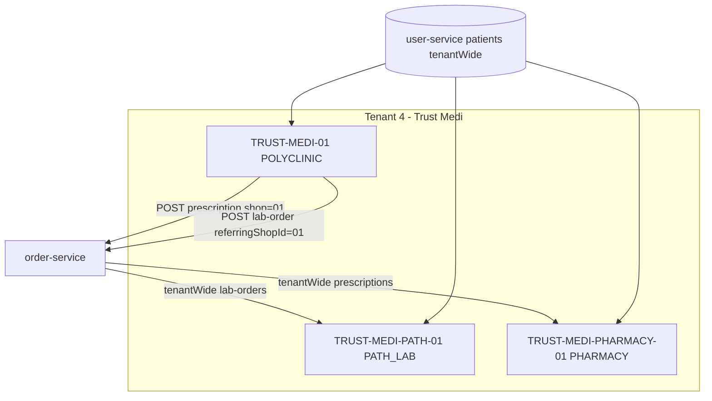

# TRUST-MEDI-01 Polyclinic Tenant Validation Report

**Tenant:** Trust Medi Centre (`tenant_id = 4`)  
**Parent / OPD:** `TRUST-MEDI-01` (`business_type = POLYCLINIC`)  
**Path Lab BU:** `TRUST-MEDI-PATH-01` (`PATH_LAB`)  
**Pharmacy BU:** `TRUST-MEDI-PHARMACY-01` (`PHARMACY`) — seed added in `infra/postgres/patches/create-trust-medi-pharmacy-shop.sql`

> **Naming note:** Demo medicines today live on **`TRUST-MEDI-01`** (in-clinic pharmacy module). The separate **`TRUST-MEDI-PHARMACY-01`** outlet is now seeded for true 3-BU testing; copy or import catalog there separately.

---

## Validation matrix

| # | Requirement | Status | Evidence / notes |
|---|-------------|--------|------------------|
| 1 | All BUs share `tenant_id = 4` | **Pass** (after pharmacy SQL) | `create-trust-medi-path-lab-shop.sql`, `create-trust-medi-pharmacy-shop.sql`, `validate-trust-medi-tenant-4.sql` |
| 2 | Patient shared across Polyclinic / Lab / Pharmacy | **Pass** | `healthcarePatients` + `tenantWide=true` on customer APIs (`user-service`, `customer.service.ts`) |
| 3a | Doctor Rx → Pharmacy | **Pass** (enhanced) | Rx saved on `TRUST-MEDI-01`; **`tenantWide` prescriptions** + pharmacy dispense lists tenant Rx (`order-service`, `pharmacy-dispense`) |
| 3b | Doctor lab order → Path Lab | **Pass** | `referringShopId`, `sourceType=POLYCLINIC`, `lab-orders?tenantWide=true` |
| 3c | Patient created once → all modules | **Pass** | UHID + tenant-wide customers |
| 3d | Unified patient history | **Partial** | Chart on doctor dashboard; no separate patient-history-service yet (see implementation plan) |
| 4 | Tenant isolation | **Pass** | All APIs require `X-Tenant-Id`; cross-tenant blocked in services |
| 5 | Role-based access | **Partial** | Permissions (`MANAGE_LAB_ORDERS`, `DISPENSE_MEDICINES`, etc.); UI routes hide modules by `business_type` — no separate “lab admin” role matrix in DB |
| 6 | `business_type` mapping | **Pass** | `POLYCLINIC`, `PATH_LAB`, `PHARMACY` in shopdb + `business-type-capabilities.ts` |
| 7 | Dashboard aggregation | **Partial** | Per-shop reporting; **no single tenant-level rollup dashboard** in UI yet |
| 8 | Billing / queue integration | **Partial** | Queue + appointments in `queue-management-service` / `appointment-service`; **not tenant-wide queue**; GST billing per shop |
| 9 | DB consistency | **Pass** (verify with SQL) | `tenant_id` + `shop_id` on clinical/commerce rows; patients keyed by tenant |
| 10 | Microservice APIs | **Pass** (routes) | Gateway: doctors, appointments, queue, products, shops, sales-admin |

---

## Architecture (current)



---

## How to run automated API tests

Prerequisites: gateway `9090`, auth-service, user/order/product/shop/doctor/appointment/queue services, seeds applied.

```powershell
# Full OPD → lab → Rx → pharmacy path (polyclinic shop)
.\scripts\test-polyclinic-full-flow.ps1 -Username trustmedicentre -Password "<password>" -ShopId TRUST-MEDI-01

# Path lab referral visibility
.\scripts\test-path-lab-integration.ps1 -Username trustmedicentre -Password "<password>" -PathLabShopId TRUST-MEDI-PATH-01

# Phase 1: appointments + queue APIs
.\scripts\test-polyclinic-phase1.ps1 -Username trustmedicentre -Password "<password>"
```

### Database audit

```powershell
psql -U postgres -h 127.0.0.1 -d shopdb -f infra/postgres/patches/validate-trust-medi-tenant-4.sql
```

Apply pharmacy shop if missing:

```powershell
psql -U postgres -h 127.0.0.1 -d shopdb -f infra/postgres/patches/create-trust-medi-pharmacy-shop.sql
```

---

## Data scoping rules

| Data | Scope | Cross-BU within tenant |
|------|--------|-------------------------|
| Patients / UHID | Tenant | Yes |
| Lab orders / results | Shop + **tenantWide** | Yes (path lab sees polyclinic referrals) |
| Prescriptions | Shop + **tenantWide** (new) | Yes (pharmacy BU dispenses polyclinic Rx) |
| Products / stock | Shop | No (each BU has own catalog) |
| Consultations / queue tokens | Shop | No |
| Doctors / departments | Shop (`TRUST-MEDI-01`) | No |

---

## Gaps vs enterprise polyclinic (recommended roadmap)

1. **Central patient profile** — allergies, chronic conditions, documents (Phase 2 in `POLYCLINIC-MANAGEMENT-IMPLEMENTATION-PLAN.md`).
2. **Tenant analytics dashboard** — rollup revenue, OPD count, lab TAT, pharmacy sales.
3. **Shared queue (optional)** — tenant-wide token board across OPD + lab reception.
4. **Event bus** — `prescription.created`, `lab-order.created` for notifications.
5. **Pharmacy catalog on `TRUST-MEDI-PHARMACY-01`** — import medicines or sync from polyclinic.
6. **Signed lab PDF / barcode** — path lab enhancements.

---

## Code changes in this validation (pharmacy cross-BU)

- `order-service`: `GET /prescriptions?tenantWide=true`; tenant-only access for dispense/PDF.
- `shop-management-ui`: `PHARMACY.tenantWideClinicalRecords = true`; pharmacy dispense passes `tenantWide`.
- `infra/postgres/patches/create-trust-medi-pharmacy-shop.sql` — third business unit seed.

Restart **order-service** and rebuild **shop-management-ui** after pulling these changes.
