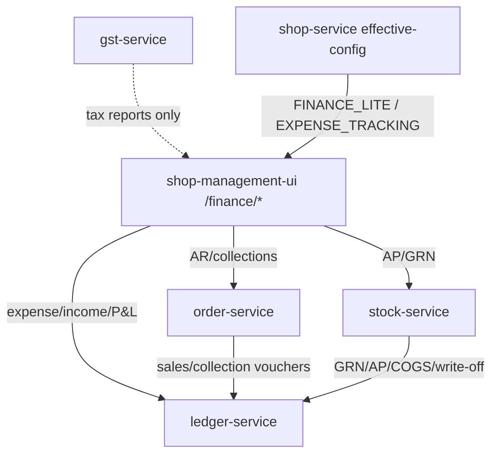

# Generic Business Expense, Income & Profit/Loss Management

**Status:** Design for approval (no full implementation yet)  
**Date:** 2026-08-08  
**Scope:** All business types (Medical, Pharmacy, Path Lab, Polyclinic, Retail, Grocery, Electronics, School, future verticals)  
**Repos:** `D:\DevData\tmp\prod-postdeploy-20260808\FINANCE-MODULE-DESIGN.md`  
**Durable copy:** `D:\sugamFlow\docs\architecture\FINANCE-MODULE-DESIGN.md`

---

## Executive recommendation (read first)

**Do not create a new `finance-service`.** Extend **`ledger-service`** as the single financial truth for Expense Category Master, Expense Entry, Recurring Expense, Other Income, and P&L aggregation. Operational capture tables post balanced double-entry vouchers into the existing GL (`ledger_accounts` / `ledger_vouchers` / `ledger_voucher_lines`). Revenue and COGS continue to originate in **order-service** and **stock-service** and flow into the same GL via existing auto-post hooks (retail POS / clinic department bills post as `POS_SALE`). **account-service** remains identity/staff accounts. **payment-service** remains platform subscription billing. **reporting-service** stays a thin metrics stub — do not build a second P&L engine there.

Wire UI under existing `/finance/*` patterns gated by `FINANCE_LITE` (and optionally activate catalog module `EXPENSE_TRACKING` as a soft entitlement flag once APIs exist). Match production `sugamflow.com` density — not a purple AI dashboard.

---

## 1. Existing architecture analysis

### 1.1 Service map (financial truth today)

| Service | Role today | Shop P&L relevance |
|---------|------------|--------------------|
| **ledger-service** (:8094) | Trade GL: CoA, vouchers, TB, P&L, BS, cash/bank book, period lock, bank recon | **Primary SoT** for books & P&L |
| **order-service** | Orders, wholesale invoices, customer `payments`, party AR, credit control, healthcare `revenue_ledger_entries` | Revenue + AR; auto-posts GL when `ledger.integration.enabled` |
| **stock-service** | GRN, batches (`purchase_price`), AP invoices/payments, COGS quote, write-offs | Cost / AP / inventory; auto-posts GL |
| **gst-service** | Tax snapshots, GSTR, e-invoice | Tax compliance — not operating P&L |
| **account-service** | Staff invite, permissions, role templates | **Not** chart of accounts |
| **payment-service** | Platform subscription payments | **Not** shop cash/collections |
| **reporting-service** | `shop_metric` overview stub | **Not** finance-ready |
| **shop-service** | Tenant/shop, `business_type`, packs, multi-branch flag | Isolation + entitlement packs |
| **auth-service / gateway** | JWT + `X-Tenant-Id` / `X-Shop-Id` | Multi-tenant safety |

### 1.2 ledger-service (FINANCE_LITE GL spine)

**Base path:** `/api/v1/ledger`  
**Scope:** every row `(tenant_id, shop_id)` from gateway headers. **No `branch_id` today** — outlet isolation = `shop_id`.

**Tables:**

- `ledger_accounts` — CoA (`ASSET|LIABILITY|INCOME|EXPENSE|EQUITY`)
- `ledger_vouchers` / `ledger_voucher_lines` — double-entry journals
- `shop_period_locks` — period close

**Default CoA (seeded):** Cash 1000, Bank 1010, Debtors 1100, Stock 1200, Creditors 2000, GST 2100/2200, TDS 2300, Capital 3000, Sales 4000, Interest Income 4100, Purchase/Freight/Discount/COGS/Write-off/CC expense 5000–5500.

**Existing reports:**

- `GET /reports/profit-and-loss?from&to` — period movement on INCOME/EXPENSE → `netProfit`
- `GET /reports/balance-sheet?asOf`
- `GET /cash-book`, `GET /trial-balance`, `GET /dashboard`

**Auto-post source types (idempotent):**  
`SALES_INVOICE`, `SALES_RETURN`, `COLLECTION`, `CREDIT_INTEREST`, `GOODS_RECEIPT`, `SUPPLIER_PAYMENT`, `STOCK_WRITE_OFF`, `LAB_CC_SETTLEMENT`, `POS_SALE` (retail / OPD / LAB / PHARMACY / IPD `orders`)

**P&L caveat (code):** Purchases capitalize to Stock (1200) at GRN; COGS (5300) posts mainly on **wholesale** invoices when batch cost is known. Stock Δ memo is exposed for trading context.

### 1.3 Domain money (not GL)

| Domain | Tables / APIs | Notes |
|--------|---------------|-------|
| Retail POS | `orders`, `order_items`, `payments` | No line COGS yet; **GL post** as `POS_SALE` when `ledger.integration.enabled` |
| Wholesale | `sales_invoices`, collections, credit interest | GL post when integration on |
| Healthcare revenue | `revenue_ledger_entries` | Parallel KPI ledger; department **paid bills also post** `POS_SALE` to trade GL |
| Procurement | GRN, AP invoices/payments, `procurement_accounting_events` outbox | GL hooks exist; outbox consumer still TBD per procurement docs |
| Subscriptions | `payment_transaction` in payment-service | Ignore for shop P&L |

### 1.4 UI (`shop-management-ui`)

Finance workspace under `/finance/*`, gated by **`PACK_FINANCE_LITE`** + `FINANCE_ACCESS_ANY` (`MANAGE_FINANCE | MANAGE_ORDERS | PROCUREMENT_FINANCE`):

| Route | Backend |
|-------|---------|
| `/finance/accounts` | ledger dashboard + sales-admin parties |
| `/finance/ledger` | CoA, vouchers, TB |
| `/finance/final-accounts` | P&L + BS + period lock |
| `/finance/cash-book` | cash/bank book |
| `/finance/party-ledger`, AR/AP ageing, collection, credit | order/stock finance APIs |
| `/reports` | Static catalogue only |

**Gaps:** No `/finance/expenses` or other-income UI. Catalog module `EXPENSE_TRACKING` exists in registration only — **never gated in nav**. No shared Angular `LedgerService` (HTTP duplicated). `ReportingService` unused stub.

### 1.5 Entitlements

- Capability pack **`FINANCE_LITE`** is the live gate for trade finance UI.
- Subscription module id **`EXPENSE_TRACKING`** is catalog/registration only.
- Platform rule: do **not** hardcode plan matrices; use packs / effective-config / `@RequiresModule` patterns already used elsewhere.

---

## 2. Gap analysis

| Requirement | Current state | Gap |
|-------------|---------------|-----|
| Expense category master (config-driven) | Only fixed CoA EXPENSE accounts | No hierarchical/business categories, tags, or vertical templates |
| Expense entry (cash/bank/payable) | Manual JOURNAL/PAYMENT vouchers in ledger workspace | No first-class expense document (vendor, receipt, approval, attachment) |
| Recurring expenses | None | No schedule / generator |
| Other income | Interest income auto-post + manual vouchers | No structured “other income” capture |
| Daily / monthly P&L | Period P&L API + Final Accounts UI | No daily rollup UX, no cash-vs-profit split dashboard |
| Cash vs profit separation | Cash book exists; P&L exists | Not presented as paired “cash movement vs accrual profit” |
| Approval workflow | Draft→Post on vouchers only | No expense-specific approver roles / thresholds |
| Multi-branch | Shop-scoped GL; shop `is_multi_branch` exists | No `branch_id` on vouchers; consolidated multi-outlet P&L missing |
| Retail revenue/COGS in P&L | Retail orders not auto-posted; dashboard GP ≠ COGS | Incomplete books for retail/grocery/pharmacy POS |
| Healthcare vs trade books | Parallel `revenue_ledger_entries` | Bridge/rules for when clinic revenue should hit trade P&L |
| Reporting / AI insights | Report centre static; no AI | Optional later — not MVP |
| AP/AR full GL subledgers | Party AR in order-service; AP in stock-service; GL aggregate 1100/2000 | Acceptable Phase 1; deepen later |
| RBAC | `MANAGE_FINANCE` + packs | Need `MANAGE_EXPENSES` / approve permissions without breaking existing |
| Financial transaction foundation | Vouchers + source_type/source_id | Need expense/income source types + operational tables |

**Biggest gaps vs desired module:** (1) expense/income CRUD exists (ledger V4/V5), (2) retail POS / clinic department bills now auto-post as `POS_SALE` when `ledger.integration.enabled=true`, (3) COGS incomplete outside wholesale, (4) `EXPENSE_TRACKING` unused, (5) no multi-branch consolidation, (6) cash-vs-profit owner view exists.

---

## 3. Recommended service ownership

### 3.1 Decision: extend ledger-service (not a new finance-service)

| Concern | Owner | Rationale |
|---------|-------|-----------|
| Expense Category Master | **ledger-service** | Categories map 1:1 (or N:1) to CoA EXPENSE accounts; same tenant/shop scope |
| Expense Entry + approval + attachments metadata | **ledger-service** | Posts `PAYMENT`/`JOURNAL` vouchers; single idempotent source |
| Recurring expense schedules | **ledger-service** | Generates expense entries → vouchers |
| Other Income Entry | **ledger-service** | Posts `RECEIPT`/`JOURNAL` to INCOME accounts |
| P&L / BS / TB / cash book | **ledger-service** (existing) | Already computed from posted GL |
| Sales revenue journals | **order-service** → ledger auto-post | Keep domain event ownership |
| COGS / GRN / AP / write-off | **stock-service** → ledger auto-post | Keep procurement ownership |
| Party AR / collections UX | **order-service** `/sales-admin/finance` | Already mature |
| Supplier AP UX | **stock-service** `/purchases/*` | Already mature |
| Staff identity / RBAC catalog | **account-service** / auth permissions | Add permission codes only |
| Subscription / packs | **shop-service** effective-config | Wire `EXPENSE_TRACKING` or pack flag — no duplicate plan editor |
| Aggregated BI / AI | **reporting-service** (later) or read APIs on ledger | Never a second GL |

### 3.2 Why not new finance-service?

- Would duplicate CoA, vouchers, period lock, and P&L already in ledger-service.
- Platform already documents money stack as payment + gst + **ledger-service**.
- Integration clients (`LedgerServiceClient` in order/stock) already target ledger.
- Extra hop increases dual-write risk and migration cost.

### 3.3 Why not account-service?

Name collision only — it owns **user accounts**, not financial accounts.

### 3.4 Optional later split

If ledger-service grows too large (attachments, OCR, AI), extract **operational capture** to `expense-service` that **only** posts to ledger via API — never store a parallel P&L. Not recommended for MVP.

---

## 4. Database / entity design

All new tables in **ledger DB** (`ledgerdb`), Flyway after `V3__period_lock_and_bank_recon.sql`.

### 4.1 ER sketch

```
tenant_id + shop_id (required on all rows)

                    +-------------------------+
                    | expense_category        |
                    |  id, code, name,        |
                    |  parent_id,             |
                    |  ledger_account_id,     |
                    |  active, system_seed    |
                    +-----------+-------------+
                                |
+-------------------+           |           +--------------------+
| recurring_expense |-----------+---------->| expense_entry      |
|  schedule, amount |           |           |  category_id,      |
|  next_run_date    |           |           |  amount, tax?,     |
+-------------------+           |           |  pay_mode, status, |
                                |           |  vendor, voucher_id|
                                |           +---------+----------+
                                |                     | posts
                                |                     v
+-------------------+           |           +--------------------+
| other_income_entry|-----------+           | ledger_vouchers    |
|  income_type_code |                       | + voucher_lines    |
|  ledger_account_id|                       +--------------------+
|  voucher_id       |
+-------------------+
```

### 4.2 Tables (proposed)

#### `expense_category`

| Column | Type | Notes |
|--------|------|-------|
| id | BIGSERIAL PK | |
| tenant_id | BIGINT | |
| shop_id | VARCHAR(64) | |
| code | VARCHAR(40) | Unique per shop |
| name | VARCHAR(200) | |
| parent_id | BIGINT NULL | Hierarchy |
| ledger_account_id | BIGINT FK → ledger_accounts | Must be EXPENSE type |
| sort_order | INT | |
| active | BOOLEAN | |
| system_seed | BOOLEAN | Template-seeded |
| created_at / updated_at | TIMESTAMP | |

**No hardcoded category names in code** — seed templates by `business_type` (configurable JSON or SQL seed sets). Shops can add/rename.

Suggested seed groups (examples, not hardcoded runtime): Rent, Utilities, Salaries, Marketing, Transport, Maintenance, Professional fees, Bank charges, Misc — each mapped to new or existing CoA codes under EXPENSE (e.g. 5600+).

#### `expense_entry`

| Column | Type | Notes |
|--------|------|-------|
| id | BIGSERIAL PK | |
| tenant_id, shop_id | | |
| entry_date | DATE | |
| category_id | FK | |
| amount | NUMERIC(14,2) | Gross or net per tax policy |
| tax_amount | NUMERIC(14,2) default 0 | Optional |
| currency | VARCHAR(3) default INR | |
| payment_mode | VARCHAR(20) | CASH, BANK, UPI, CREDIT (AP accrual) |
| cash_account_code | VARCHAR(40) | 1000/1010 or payable mapping |
| vendor_name | VARCHAR(200) | Free text MVP; party link later |
| vendor_party_id | BIGINT NULL | Future AP link |
| narration | VARCHAR(500) | |
| status | VARCHAR(20) | DRAFT, PENDING_APPROVAL, APPROVED, POSTED, VOID |
| requested_by | VARCHAR(100) | |
| approved_by / approved_at | | |
| voucher_id | BIGINT NULL | FK logical to ledger_vouchers |
| source_type | VARCHAR(40) | `EXPENSE_ENTRY` or `RECURRING_EXPENSE` |
| recurring_id | BIGINT NULL | |
| attachment_uri | VARCHAR(500) NULL | Object storage key |
| branch_shop_id | VARCHAR(64) NULL | Optional override for multi-outlet posting (= shop_id MVP) |
| created_at / updated_at | | |

Unique idempotency: reuse voucher `(tenant_id, shop_id, source_type, source_id)` with `source_id = expense_entry.id`.

#### `recurring_expense`

| Column | Type | Notes |
|--------|------|-------|
| id | BIGSERIAL PK | |
| tenant_id, shop_id | | |
| category_id | FK | |
| amount | NUMERIC(14,2) | |
| payment_mode | | |
| frequency | VARCHAR(20) | DAILY, WEEKLY, MONTHLY, YEARLY |
| day_of_month / weekday | | Frequency helpers |
| start_date / end_date | | |
| next_run_date | DATE | |
| active | BOOLEAN | |
| auto_post | BOOLEAN | false → create DRAFT/PENDING |
| narration_template | VARCHAR(500) | |

Job: scheduled runner (ledger-service `@Scheduled` or platform cron) creates `expense_entry` rows.

#### `other_income_entry`

| Column | Type | Notes |
|--------|------|-------|
| id | BIGSERIAL PK | |
| tenant_id, shop_id | | |
| entry_date | DATE | |
| income_type_code | VARCHAR(40) | Config → ledger INCOME account |
| ledger_account_id | FK | e.g. 4100 or new 4200 Misc Income |
| amount | NUMERIC(14,2) | |
| payment_mode | CASH/BANK/UPI/AR | |
| payer_name | VARCHAR(200) | |
| narration | | |
| status | DRAFT…POSTED/VOID | |
| voucher_id | | |
| source_type | `OTHER_INCOME` | |

#### `income_type` (optional config table)

Maps `code` → `ledger_account_id` per shop (Interest, Commission, Scrap sale, Rental income, Grant, Misc). Seeded, editable — **not hardcoded**.

#### CoA extensions (seed, not hardcode)

Add inactive-until-seeded EXPENSE range **5600–5699** (OpEx) and INCOME **4200–4299** (Other income) via `ChartOfAccountsService` seed profiles keyed by business type. Existing 5000–5500 trade accounts remain.

#### Branch strategy (phased)

- **MVP:** `shop_id` = books boundary (matches JWT). Multi-branch businesses already modeled as multiple shops / outlet registry.
- **Phase 2:** optional `branch_shop_id` on entries + consolidated P&L API accepting `shopIds[]` for same `tenant_id` (owner-only). Avoid inventing a second branch dimension until shop-service branch model is unified.

### 4.3 What we deliberately do **not** store

- Parallel `financial_transactions` that never post to GL.
- Denormalized P&L fact tables as SoT (optional **read cache** later in reporting-service).
- Duplicate party ledgers (keep order/stock).

---

## 5. API design

Base: **`/api/v1/ledger`** (gateway → ledger-service). All calls require `X-Tenant-Id`, `X-Shop-Id`, Bearer JWT.

### 5.1 Categories

| Method | Path | Description |
|--------|------|-------------|
| GET | `/expense-categories` | List (tree or flat) |
| POST | `/expense-categories` | Create |
| PUT | `/expense-categories/{id}` | Update (not system account unlink without admin) |
| POST | `/expense-categories/seed-defaults` | Seed from business-type template |
| GET | `/income-types` | List other-income types |
| POST | `/income-types/seed-defaults` | Seed |

### 5.2 Expense entries

| Method | Path | Description |
|--------|------|-------------|
| GET | `/expenses?from&to&status&categoryId` | List / filter |
| GET | `/expenses/{id}` | Detail |
| POST | `/expenses` | Create DRAFT |
| PUT | `/expenses/{id}` | Edit while DRAFT/PENDING |
| POST | `/expenses/{id}/submit` | → PENDING_APPROVAL |
| POST | `/expenses/{id}/approve` | → APPROVED |
| POST | `/expenses/{id}/post` | Create+post voucher; → POSTED |
| POST | `/expenses/{id}/void` | Reverse voucher if posted |

**Posting rules (PAYMENT / JOURNAL):**

- Cash/Bank/UPI: `Dr Expense account` / `Cr Cash|Bank`
- CREDIT (accrual): `Dr Expense` / `Cr Creditors (2000)` or dedicated OpEx payable
- With tax (optional Phase 1.5): split GST input to 2200 when applicable

### 5.3 Recurring

| Method | Path |
|--------|------|
| GET/POST | `/recurring-expenses` |
| PUT | `/recurring-expenses/{id}` |
| POST | `/recurring-expenses/{id}/run-now` |
| POST | `/recurring-expenses/run-due` | Internal/cron |

### 5.4 Other income

| Method | Path |
|--------|------|
| GET/POST | `/other-incomes` |
| POST | `/other-incomes/{id}/post` | `Dr Cash|Bank` / `Cr Income` |
| POST | `/other-incomes/{id}/void` | |

### 5.5 P&L / dashboards (extend existing)

| Method | Path | Description |
|--------|------|-------------|
| GET | `/reports/profit-and-loss` | **Keep** — already SoT |
| GET | `/reports/profit-and-loss/daily?from&to` | New: daily net profit series |
| GET | `/reports/cash-vs-profit?from&to` | New: cash in/out (1000/1010) vs accrual netProfit |
| GET | `/dashboard` | Extend KPIs: opex MTD, other income MTD |

### 5.6 Auto-post source types (add)

`EXPENSE_ENTRY`, `RECURRING_EXPENSE`, `OTHER_INCOME`  
(plus future `RETAIL_SALES_INVOICE` when retail GL enabled)

### 5.7 Permissions

| Permission | Use |
|------------|-----|
| `MANAGE_FINANCE` | Full (existing) |
| `MANAGE_EXPENSES` | Create/submit expenses (new; optional) |
| `APPROVE_EXPENSES` | Approve above threshold (new; optional) |
| `VIEW_FINANCE_REPORTS` | P&L read (optional split later) |

MVP may map all to `MANAGE_FINANCE` / `MANAGE_ORDERS` like current ledger controller to avoid breaking roles; introduce finer codes in Phase 1.5.

### 5.8 Compatibility

- Do **not** change response shapes of existing P&L/BS endpoints except additive fields.
- Manual voucher APIs remain for accountants.

---

## 6. UI/UX flow

Follow production Finance shell: page title + subtitle, filters, dense table, status badges, View/More actions — **not** card-heavy AI dashboards.

### 6.1 Navigation (Finance group)

Add under existing Finance sidebar (`financeLiteOnly`):

1. **Expenses** → `/finance/expenses`
2. **Other income** → `/finance/other-income`
3. **Recurring** → `/finance/recurring-expenses` (or tab under Expenses)
4. Keep **Final Accounts**, **Cash book**, **Accounts**, **Ledger**

Gate: `FINANCE_LITE` pack; optionally also `hasModule('EXPENSE_TRACKING')` when product wants module-level upsell — default recommend **pack OR module** so wholesale shops with FINANCE_LITE already see Expenses.

### 6.2 Screens

**A. Expense list**

- Filters: date range, category, status, payment mode, search vendor/narration
- Columns: Date, Category, Vendor, Mode, Amount, Status, Actions (View / Approve / Post / Void)
- Primary CTA: **+ Add expense**
- Secondary: Export CSV (later)

**B. Add / edit expense**

- Date, Category (from master), Amount, Payment mode, Cash/Bank account, Vendor, Narration, Attachment
- Save draft / Submit for approval / Post (owner shortcut)
- Show linked voucher id after post

**C. Category master** (settings tab or `/finance/expense-categories`)

- Tree list, map to GL account, Seed defaults, Active toggle
- Warn if GL account inactive

**D. Other income**

- Mirror expense list with income types

**E. Recurring**

- Schedule table + next run + Run now

**F. Owner cash vs profit** (enhance Accounts dashboard / Final Accounts)

- Two tiles: **Cash movement** (from cash book period totals) vs **Net profit** (P&L)
- Short helper text: “Cash ≠ Profit (credit sales, stock, unpaid expenses)”
- Link to Final Accounts for full P&L

**G. Daily P&L**

- Simple date-series table or sparkline-compatible rows (keep visual language of wholesale dayboard)

### 6.3 Roles

| Role | Flow |
|------|------|
| Staff | Create/submit expense |
| Manager/Accountant | Approve + post; manage categories |
| Owner | Full + dashboards; period lock remains on Final Accounts |

### 6.4 Vertical neutrality

Labels from shop header labels where needed (“Outlet” vs “Branch”). Same screens for Medical/Retail/School — category seeds differ by `business_type`.

---

## 7. P&L calculation logic

### 7.1 Source of truth

**Always** ledger posted vouchers (`status=POSTED`), via existing `FinalAccountsService.profitAndLoss`:

```
For each CoA account with period movement:
  INCOME  → credit-biased signed amount → Income section
  EXPENSE → debit-biased signed amount → Expense section
netProfit = totalIncome - totalExpenses
```

Plus existing **stock memo**: opening/closing Stock (1200), `stockIncrease`.

### 7.2 How module lines enter P&L

| Business event | GL effect | P&L impact |
|----------------|-----------|------------|
| Expense posted (cash) | Dr OpEx / Cr Cash | ↑ Expenses → ↓ profit; cash ↓ |
| Expense posted (credit) | Dr OpEx / Cr Creditors | ↑ Expenses → ↓ profit; cash unchanged |
| Other income posted | Dr Cash / Cr Other Income | ↑ Income → ↑ profit; cash ↑ |
| Wholesale sale (existing) | Dr Debtors / Cr Sales (+ GST); Dr COGS / Cr Stock | Revenue + COGS |
| Collection (existing) | Dr Cash / Cr Debtors | Cash ↑; **no P&L** |
| GRN (existing) | Dr Stock / Cr Creditors | Balance sheet; stock memo |
| Retail sale (Phase 2) | Same pattern as wholesale | Closes retail P&L gap |

### 7.3 Cash vs profit (explicit formulas)

For period `[from, to]`:

```
accrualNetProfit = P&L.netProfit

cashIn  = sum(debits to 1000/1010 in period)   // or use AccountBook period totals
cashOut = sum(credits to 1000/1010 in period)
netCashMovement = cashIn - cashOut   // define sign consistently with cash-book API
```

UI must never label cash movement as “profit”.

### 7.4 Daily / monthly

- **Monthly / custom range:** existing P&L endpoint.
- **Daily:** either N calls server-side aggregated in `/reports/profit-and-loss/daily`, or one SQL grouping `voucher_date` × account_type (prefer single query).

### 7.5 Gross vs net profit (product definitions)

| Metric | Definition (target) | Today |
|--------|---------------------|-------|
| Gross profit | Sales − COGS (− sales returns) | Partial (wholesale COGS only) |
| Operating profit | Gross − OpEx (expense module) | OpEx missing until expenses post |
| Net profit | Operating ± other income/expense | = current `netProfit` once feeds complete |

Executive dashboard “gross profit” that uses `subtotal - discount` must be **relabeled or fixed** in Phase 2 so owners are not misled.

### 7.6 Healthcare / school

- Keep clinical `revenue_ledger_entries` for specialty dashboards.
- If a vertical needs trade P&L, post bridge vouchers (or enable order→ledger for that bill type) — do not merge tables ad hoc.

---

## 8. Integration points with existing modules



| Module | Integration |
|--------|-------------|
| Orders / Invoices | Revenue journals; Phase 2 retail auto-post |
| Stock / Procurement | COGS quote, GRN capitalization, AP payments |
| Payments (customer) | Collections → cash/debtors; not expense |
| GST | Optional ITC on expense tax lines later |
| Path lab CC settlement | Existing Dr 5500 — leave as domain expense |
| IPD / clinic revenue | Stay on revenue_ledger unless product asks for bridge |
| Subscription | Pack/module flags only |
| Notification | Optional approve/reject notify (Phase 1.5) |
| Fieldforce | Future: travel expense category + attachment — same API |

**Idempotency:** all posts use `source_type` + `source_id`.  
**Period lock:** expense/income post must respect `shop_period_locks` (same as vouchers).  
**Flag:** `ledger.integration.enabled` for domain→GL; expense module lives *inside* ledger so always “on” when service deployed.

---

## 9. Migration strategy

### 9.1 Schema

1. Flyway `V4__expense_income_operational.sql` — categories, expenses, recurring, income types/entries.
2. Flyway `V5__opex_coa_seed_codes.sql` — optional system CoA codes 5600+/4200+ (inactive until seed-defaults).
3. Expand unique index on voucher sources to include new source types (already partial unique on non-null source).

### 9.2 Data backfill

| Source | Action |
|--------|--------|
| Existing manual EXPENSE voucher lines | Leave as-is; optional “link orphan” tool later |
| Historical OpEx never in GL | No automatic invention; start clean from go-live date |
| Category seed | On first `seed-defaults` per shop |

### 9.3 Config / entitlements

1. Keep `FINANCE_LITE` as primary UI gate.
2. Activate `EXPENSE_TRACKING` in effective-config for verticals that sell the module — **enforcement via pack/module check in UI + permission**, not a second plan engine.
3. Production: ensure `LEDGER_INTEGRATION_ENABLED=true` where wholesale/AP already rely on GL.

### 9.4 API compatibility

- Additive endpoints only under `/api/v1/ledger/...`.
- No breaking changes to `/reports/profit-and-loss`.
- Gateway route already forwards `/api/v1/ledger/**`.

### 9.5 Rollback

- Feature flag `ledger.expense-module.enabled` (default false until UI ships).
- Dropping tables only in non-prod; prod disable flag leaves data intact.

---

## 10. Implementation plan

### Phase 0 — Foundation (safe, small) ✅ design-only until approved

- [ ] Design review / approval (this document)
- [ ] Confirm ownership: ledger-service + FINANCE_LITE UI
- [ ] Feature branch: `feature/expense-income-pnl` on `ledger-service` and `shop-management-ui` (from latest `dev`)
- [ ] Flag `ledger.expense-module.enabled`

### Phase 1 — MVP (ship value)

**Backend (ledger-service)**

1. Flyway V4 tables + repositories
2. Category CRUD + business-type seed templates (config/SQL, not hardcoded enums in services)
3. Expense entry lifecycle: draft → (optional approve) → post voucher
4. Other income entry + post
5. Source types `EXPENSE_ENTRY`, `OTHER_INCOME`
6. Extend dashboard KPIs (opex MTD, other income MTD)
7. `GET /reports/cash-vs-profit`

**UI (shop-management-ui)**

1. Routes `/finance/expenses`, `/finance/other-income`, category management
2. Shared thin `LedgerApiService` (stop duplicating HTTP)
3. Nav entries; production-like tables
4. Accounts dashboard tiles: cash vs profit

**Out of MVP:** recurring job, attachments OCR, AI, retail COGS auto-post, multi-shop consolidate, GST on expenses, AP party link.

### Phase 2 — Completeness

1. Recurring expenses + cron
2. Approval thresholds + `APPROVE_EXPENSES`
3. Attachments (S3/minio URI)
4. Daily P&L series API + UI
5. Retail POS → ledger sales + COGS (order-service + stock cogs-quote)
6. Fix misleading retail “gross profit” metric
7. Wire `EXPENSE_TRACKING` module flag for packaging
8. Optional consolidated tenant P&L across outlet shop_ids

### Phase 3 — Full finance depth

1. Deeper AP/AR subledger sync into GL (party dimensions on voucher lines)
2. Budgets vs actual by category
3. reporting-service read models / exports
4. Optional AI insights (anomaly opex, margin commentary) — **read-only**, never alternate books
5. gst_ledger_entry alignment per GST enterprise architecture
6. procurement_accounting_events full consumer if still TBD

### Suggested first PR slices (after approval)

| PR | Repo | Content |
|----|------|---------|
| 1 | ledger-service | V4 schema + category + expense post |
| 2 | ledger-service | other income + cash-vs-profit |
| 3 | shop-management-ui | Expenses UI + nav |
| 4 | shop-management-ui | Other income + dashboard tiles |
| 5 | order-service | Retail GL post (Phase 2) |

---

## Blocking questions (need user approval)

1. **Ownership OK?** Confirm extend **ledger-service** (recommended) vs new finance-service.
2. **Approval workflow in MVP?** Simple post-by-finance-role vs mandatory PENDING_APPROVAL.
3. **Entitlement:** Gate expenses by `FINANCE_LITE` only, or require `EXPENSE_TRACKING` module too?
4. **Retail GL:** Is Phase 2 retail auto-post in scope for first release, or accept P&L incomplete for pure POS shops until then?
5. **Healthcare:** Should polyclinic/IPD revenue stay out of trade P&L (recommended), or bridge in Phase 2?
6. **Multi-branch:** OK to treat outlet = `shop_id` for MVP?

---

## Appendix A — Explicit non-goals (MVP)

- Replacing party ledger / collection desk
- Moving subscription billing into shop P&L
- Rewriting Final Accounts from reporting-service
- Purple/indigo redesign of Finance nav
- Hardcoded category enums in Java/TS

## Appendix B — Key existing endpoints (reuse)

```
GET  /api/v1/ledger/reports/profit-and-loss?from&to
GET  /api/v1/ledger/reports/balance-sheet?asOf
GET  /api/v1/ledger/cash-book?accountCode=1000|1010&from&to
GET  /api/v1/ledger/trial-balance?asOf
POST /api/v1/ledger/vouchers + /{id}/post
POST /api/v1/ledger/vouchers/from-sales-invoice|from-collection|from-goods-receipt|...
GET  /api/v1/sales-admin/finance/*          (AR)
GET  /api/v1/stock/purchases/ap-*           (AP)
```

## Appendix C — Document control

| Version | Date | Author | Notes |
|---------|------|--------|-------|
| 0.1 | 2026-08-08 | Architecture design pass | Awaiting user approval before coding |
