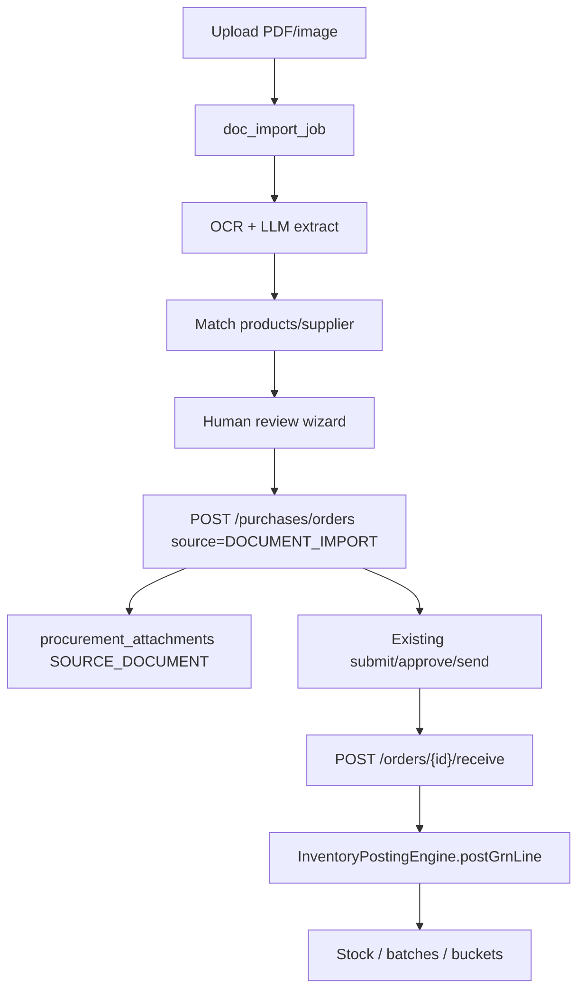

# Upload PO Document (AI/OCR) — Design

**Status:** Design for approval — **no full implementation yet**  
**Date:** 2026-08-08  
**Scope:** SugamFlow ERP — PDF/JPG/PNG/scanned purchase-order documents → OCR+AI extract → match → human review → create normal PO → GRN → stock via existing stock-service  
**Repos:** `D:\DevData\tmp\prod-postdeploy-20260808\PO-OCR-UPLOAD-DESIGN.md`  
**Durable copy:** `D:\sugamFlow\docs\architecture\PO-OCR-UPLOAD-DESIGN.md`

---

## Executive summary

Build a **reusable document-processing / AI-import capability** that turns supplier PO PDFs/images into **draft purchase orders** after human review. Stock must **never** change on upload; inventory moves only through the existing **GRN → `InventoryPostingEngine.postGrnLine`** path.

**Recommended ownership:** new lightweight **`document-import-service`** (or first module living in stock-service behind a clear package boundary, extracted later) that owns upload jobs, OCR/LLM extraction, match proposals, and review state — then **calls existing** `POST /purchases/orders` (and later receive/AP APIs). Do **not** stuff OCR/LLM orchestration into stock-service’s inventory posting core.

**Distinguish from production “Procurement (auto PO)”:** that feature is **low-stock scan → compile → `source=AUTO_REPLENISH` drafts**. This feature is **document OCR → match → `source=DOCUMENT_IMPORT` (new) drafts**. Same PO/GRN/stock downstream; different intake.

---

## 1. Existing architecture analysis

### 1.1 stock-service — purchases / GRN / stock

| Area | Location / facts |
|------|------------------|
| PO entity | `PurchaseOrder` → `purchase_orders` (`BranchScopedEntity`: `tenant_id`, `shop_id`, `branch_id`) |
| PO lines | `purchase_order_lines`: `productId`, name snapshot, qty, costs, GST, receive counters |
| Sources today | `MANUAL` (form create), `AUTO_REPLENISH` (evening compile). **No document-import source yet.** |
| PO APIs | `PurchaseOrderController` — `/purchases/orders` and `/stock/purchases/orders` |
| Create | `POST /` with `UpsertPurchaseOrderRequest` (`supplierId`, dates, `lines[]` with `productId`) |
| Workflow | confirm **or** universal submit → approve → send; then receive |
| Receive / GRN | `POST /{id}/receive` + `ReceiveGoodsRequest` + optional `X-Idempotency-Key` |
| GRN entity | `GoodsReceipt` / `goods_receipts` (`grnNumber` like `GRN-…`); lines with qty splits (V10) |
| Stock posting | `PurchaseOrderService.receive` → `InventoryPostingEngine.postGrnLine` → batches/buckets/`inventory_transactions` (`referenceType=GRN`) → aggregate `Stock` |
| Direct GRN | `POST /purchases/goods-receipts/direct` (no PO) |
| Accounting | `GrnAccountingHooks` → **ledger-service** voucher + `procurement_accounting_events` outbox — **not account-service** |
| Audit | `procurement_audit_events` via `ProcurementAuditService`; `GET /orders/{id}/audit` |
| Attachments | `procurement_attachments` + local FS `./data/procurement-attachments` (JPEG/PNG/WebP/PDF, magic-byte check) |
| Module gate | `@RequiresModule(ModuleCode.PURCHASE)` |
| Tenancy | `RequestIdFilter` requires `X-Tenant-Id`, `X-Shop-Id`; repos scoped by tenant+shop |

**Critical invariant (preserve):** upload/OCR must not call receive, direct GRN, or any inventory posting API.

### 1.2 Intelligent procurement (“auto PO”) — related but separate

| Piece | Behavior |
|-------|----------|
| Controllers | `ProcurementController` `/purchases/procurement` |
| Flow | Scan low stock → `low_stock_queue` → compile → draft POs `source=AUTO_REPLENISH`, `poNumber` like `AUTO-…`, `approvalStatus=PENDING_APPROVAL` |
| Approve | `POST .../drafts/{poId}/approve\|reject` |
| UI | `/stocks/procurement` — “Intelligent procurement” |
| Reuse | Human **draft → approve** UX, supplier mappings, permissions (`PROCUREMENT_*`), audit events |

### 1.3 Suppliers & supplier catalog

- Suppliers live in **stock-service** (`/purchases/suppliers`), not order-service / account-service.
- `SupplierProductMapping` (`supplier_product_mapping`): `supplierSku`, `supplierPartNumber`, MOQ, last price, priority — **stored but no SKU/part lookup API today**; catalog search proxies product-service name/code search then filters mapped products.
- UI: supplier form + product form procurement sections use `ProcurementService` mappings.

### 1.4 product-service — matching inputs

| Capability | API / notes |
|------------|-------------|
| Paged search | `GET /products/page?search=` — tokenized LIKE (code, name, barcode, medicine/auto fields); **not** Levenshtein |
| Barcode | `GET /products/lookup/barcode?value=` — exact, case-insensitive |
| Medicine search | `GET /products/medicine-search?q=` |
| Auto-parts scored search | `GET /auto-parts/search?q=` + `auto_part_alternate_numbers` aliases |
| Identity fields | `code`, `name`, `barcode`, `hsnSac`, brand, medicine manufacturer/composition/generic, OEM |
| HSN rates | **gst-service** `GET /api/v1/gst/hsn/search`, `/{hsnCode}/rate` |
| CSV import pattern | `/products/import` — upload → validate → mapping → confirm jobs; local `./data/product-import`; optional Rabbit — **best job-wizard pattern to mirror** |

**Gap:** no generic `product_alias` / synonym table for retail/pharmacy supplier descriptions.

### 1.5 account-service relevance

**None for AP/PO.** `account-service` is staff identity. Purchase AP = stock-service `SupplierApInvoice*`; GL = ledger-service. Do not put OCR financial logic in account-service.

### 1.6 shop-management-ui — PO screens

| Route | Role |
|-------|------|
| `/stocks/purchase-orders` | List (+ New PO, View, Edit draft, Receive) |
| `/stocks/purchase-orders/add\|edit/:id` | Manual draft form |
| `/stocks/purchase-orders/:id` | Detail, workflow, print, GRN list + attachments |
| `/stocks/purchase-orders/:id/receive` | GRN posting UI |
| `/stocks/purchase-bill` | Receive hub |
| `/stocks/direct-grn` | Blank GRN |
| `/stocks/procurement` | Auto PO hub |

Services: `PurchaseOrderService` → `stock/purchases/orders`; `ProcurementAttachmentsService` → evidence only (no OCR).

### 1.7 Existing AI / OCR / file patterns (reuse ideas, not code dump)

| Pattern | Where | Lesson |
|---------|-------|--------|
| Lab AI draft | order-service `POST .../lab-report-versions/{id}/ai-draft` | Sync draft + **human review before commit** |
| Lab Rx OCR | `POST .../lab-rx-ocr/suggest` `{ text }` → suggestions + confidence; jobs table; **text-only today** |
| Shop AI flags | `shop-ai-features.ts` (`prescriptionOcr`, `labRxOcr`, …) | Gate UI; no silent auto-post |
| CRM card OCR | crm-service `/ocr/card` | **Stub** heuristic — do not treat as production OCR |
| Product import | product-service multipart job wizard | Durable job + preview + confirm |
| Attachments | stock-service local FS | Tenant/shop path isolation; magic bytes |

**Finding:** No half-built “Upload PO Document” stub. Attachments + auto-PO + lab AI are adjacent patterns only.

---

## 2. Gap analysis

| Gap | Impact |
|-----|--------|
| No document OCR pipeline for procurement | Feature does not exist |
| No `DOCUMENT_IMPORT` (or similar) PO `source` | Cannot distinguish OCR drafts from MANUAL/AUTO_REPLENISH |
| No import-job / extraction / match-result entities | Nowhere to store confidence, review edits, audit chain |
| No supplier SKU/part reverse lookup API | Matching cannot use best existing mapping fields efficiently |
| No fuzzy / alias layer for free-text PO lines | Low match rates on messy supplier names |
| No duplicate PO detection beyond `existsBy…PoNumber` | Same supplier PO# / PDF re-upload can create doubles |
| Attachments are evidence-only | No OCR attachment type; UI does not attach on PO create |
| No object storage abstraction | Local FS only — fragile for multi-EC2 / scale |
| No async OCR worker | Lab OCR is sync+text; PDF/vision needs queue + timeouts |
| UI has no upload wizard on PO list | Need production-density wizard, not purple AI dashboard |
| Feature flag missing | Need shop-level `poDocumentOcr` (or similar) + `PROCUREMENT_*` permissions |
| Audit chain incomplete for “document → extraction → PO → GRN → stock” | Need correlation id across services |

---

## 3. Recommended service ownership

### Recommendation (preferred)

**Own OCR/import in a dedicated `document-import-service`** (platform-reusable), with a thin **stock-service adapter** for match lookups + PO create.

```
[UI wizard]
    → document-import-service (upload, OCR/LLM, extract JSON, match proposals, review session)
        → product-service (barcode/search)
        → stock-service (supplier, supplierSku mapping lookup, create PO, attach file, audit)
            → later: existing receive / InventoryPostingEngine (unchanged)
```

### Why not stuff into stock-service?

| Stuff into stock-service | Dedicated document-import-service |
|--------------------------|----------------------------------|
| Mixes LLM/OCR/retry/provider secrets with inventory correctness | Keeps stock-service focused on PO/GRN/stock integrity |
| Harder to reuse for invoice/challan/GRN/lab Rx image OCR later | One framework: `docType=PURCHASE_ORDER\|SUPPLIER_INVOICE\|CHALLAN\|GRN` |
| Bloats PURCHASE module with vision deps | Independent scale, rate limits, provider keys |
| Risk of accidental stock side-effects in same deploy unit | Clear API boundary: import service **never** posts GRN |

### Pragmatic Phase-0 option (acceptable)

If a new service is too heavy for MVP ops: implement package `com.shopmanagement.stockservice.docimport` **inside stock-service** with:

- Separate DB tables (prefix `doc_import_*`)
- Separate controller base `/purchases/document-imports`
- No calls into `InventoryPostingEngine` from that package
- Explicit ADR: extract to `document-import-service` when invoice/challan OCR lands

**Still prefer dedicated service** if gateway + docker compose can host one more JVM (mirrors long-term “reusable framework” requirement).

### What stays in stock-service either way

- Supplier resolve, PO create/approve/send/receive
- Attachment binary storage (or shared blob adapter)
- Procurement audit events
- GRN → stock (unchanged)

### What stays out

- account-service, subscription logic, parallel inventory ledgers
- Auto-replenish compile engine (reuse UX patterns only)

---

## 4. Database / entity design

All tables: `tenant_id`, `shop_id`, optional `branch_id`, soft-delete where needed. Prefer DB of **document-import-service** (or stock-service if Phase-0 colocated).

### 4.1 `doc_import_jobs`

| Column | Type | Notes |
|--------|------|-------|
| `id` | BIGSERIAL | |
| `tenant_id`, `shop_id`, `branch_id` | | Isolation |
| `doc_type` | VARCHAR | `PURCHASE_ORDER` (later `SUPPLIER_INVOICE`, `CHALLAN`, `GOODS_RECEIPT`) |
| `status` | VARCHAR | `UPLOADED`, `PROCESSING`, `EXTRACTED`, `MATCHED`, `NEEDS_REVIEW`, `READY_TO_COMMIT`, `COMMITTED`, `FAILED`, `CANCELLED`, `DUPLICATE_BLOCKED` |
| `storage_ref` | VARCHAR | Opaque blob key / relative path |
| `content_type`, `file_name`, `file_size`, `file_sha256` | | Dedup + integrity |
| `ocr_engine`, `llm_engine` | | e.g. `TESSERACT`, `AWS_TEXTRACT`, `OPENAI_VISION` |
| `overall_confidence` | NUMERIC | 0–1 |
| `supplier_id_guess`, `supplier_confidence` | | |
| `extracted_po_number`, `extracted_po_date` | | For duplicate detection |
| `duplicate_of_job_id`, `duplicate_of_po_id` | | Soft-block |
| `created_purchase_order_id` | | Set only after commit |
| `correlation_id` | VARCHAR(64) | Propagate to `procurement_audit_events` |
| `created_by`, `reviewed_by`, timestamps, `error_message` | | |

### 4.2 `doc_import_extractions`

| Column | Notes |
|--------|-------|
| `job_id` FK | One current + optional history versions |
| `raw_ocr_text` TEXT | |
| `structured_json` JSON/JSONB | Header + lines as model output |
| `schema_version` | e.g. `po-extract-v1` |
| `provider_response_ref` | Optional truncated payload / S3 side-car |

**Canonical structured payload (`po-extract-v1`):**

```json
{
  "supplier": { "name": "", "gstin": "", "code": "", "address": "" },
  "poNumber": "",
  "poDate": "YYYY-MM-DD",
  "expectedDate": null,
  "currency": "INR",
  "notes": "",
  "lines": [
    {
      "lineNo": 1,
      "description": "",
      "supplierSku": "",
      "barcode": "",
      "hsn": "",
      "qty": 0,
      "uom": "",
      "unitCost": 0,
      "gstPercent": null,
      "discountPercent": null,
      "lineTotal": null
    }
  ],
  "totals": { "subtotal": null, "tax": null, "grandTotal": null }
}
```

### 4.3 `doc_import_match_results`

| Column | Notes |
|--------|-------|
| `job_id`, `line_no` | |
| `extracted_snapshot_json` | Immutable extract slice |
| `candidate_product_ids_json` | Ranked list |
| `selected_product_id` | Null until auto or human pick |
| `match_method` | `BARCODE`, `SUPPLIER_SKU`, `SUPPLIER_PART`, `CODE_EXACT`, `NAME_TOKEN`, `AUTO_PART_ALIAS`, `MANUAL`, `UNMATCHED` |
| `confidence` | 0–1 |
| `tier` | `AUTO`, `SUGGEST`, `MANUAL` (see §7) |
| `unit_cost_resolved`, `qty_resolved`, `gst_percent_resolved` | Editable in review |
| `user_override` BOOL | |

### 4.4 Document storage refs

Store storage metadata on the job; **on commit** copy/link into `procurement_attachments` with `entity_type=PURCHASE_ORDER`, `attachment_type=SOURCE_DOCUMENT`.

### 4.5 Linkage on existing tables (minimal)

| Change | Purpose |
|--------|---------|
| `purchase_orders.source` allow `DOCUMENT_IMPORT` | Parallel to `AUTO_REPLENISH` |
| Optional `purchase_orders.doc_import_job_id` | Hard link for audit UI |
| Duplicate checks | `file_sha256`; supplier + extracted PO# vs existing `po_number` / prior jobs |

### 4.6 Audit trail chain

1. Job `correlation_id` = UUID  
2. On commit: `ProcurementAuditService` event `DOCUMENT_IMPORT_COMMITTED` on PO with `after_json` including `jobId`, storage ref, confidence  
3. Existing GRN/receive audits continue  
4. Stock transactions already carry `referenceType=GRN`  
5. UI lineage: Document → Job → Extraction → Matches → PO → GRN(s) → inventory txns

---

## 5. API design

Gateway JWT + forwarded `X-Tenant-Id` / `X-Shop-Id` / auth headers (same as stock-service). Module: `PURCHASE` + new permission e.g. `PROCUREMENT_DOC_IMPORT` (or reuse `PROCUREMENT_APPROVE` for commit).

Base (preferred): `/api/v1/document-imports`  
Colocated alt: `/api/v1/stock/purchases/document-imports`

| Method | Path | Purpose |
|--------|------|---------|
| POST | `/` multipart `file`, `docType=PURCHASE_ORDER`, optional `supplierId` hint | Create job; store blob; enqueue OCR |
| GET | `/{jobId}` | Status + summary |
| GET | `/{jobId}/extraction` | Structured extract + raw text |
| POST | `/{jobId}/reprocess` | Re-run OCR/LLM |
| POST | `/{jobId}/match` | Re-run matching (after supplier pick) |
| GET | `/{jobId}/matches` | Per-line candidates + tiers |
| PUT | `/{jobId}/matches/{lineNo}` | Human override product/qty/cost/GST |
| PUT | `/{jobId}/header` | Correct supplier, dates, PO# |
| GET | `/{jobId}/duplicates` | Soft duplicates found |
| POST | `/{jobId}/commit` | **Creates PO only** via stock-service; attaches source doc; returns `purchaseOrderId` |
| POST | `/{jobId}/cancel` | Abandon |
| GET | `/page?status=&docType=` | History |
| GET | `/{jobId}/document` | Download original (authorized) |

**Commit contract:** validates all lines resolved; calls existing `POST /purchases/orders`; sets `source=DOCUMENT_IMPORT`; **never** calls `/receive` or inventory APIs; idempotent on second commit.

**Stock-service additions for matching:**

| Method | Path | Purpose |
|--------|------|---------|
| GET | `/purchases/procurement/supplier-mappings/lookup?supplierId=&sku=` | Exact `supplierSku` / `supplierPartNumber` |
| GET | `/purchases/suppliers/resolve?gstin=&name=` | Best-effort supplier match for header |

---

## 6. UI/UX flow (wizard — production density)

Match **sugamflow.com** shell: page title + subtitle, compact tables, existing buttons — **no** purple AI dashboard / card walls.

### Entry points

1. **PO list** (`/stocks/purchase-orders`): secondary button **Upload PO document** next to **+ New PO**  
2. Optional: Procurement hub note distinguishing Auto PO vs Upload document  
3. PO detail: “Imported from document” badge + job link when `source=DOCUMENT_IMPORT`

### Wizard steps (route e.g. `/stocks/purchase-orders/import`)

1. **Upload** — PDF/JPG/PNG; optional supplier pre-select  
2. **Processing** — status poll; errors retry  
3. **Header review** — supplier, PO#, dates, duplicate warnings  
4. **Line matching** — extract vs matched product + confidence badge (`High` / `Review` / `Manual`)  
5. **Confirm** — summary; **Create purchase order**  
6. **Done** — navigate to PO detail; explicit: stock not updated until Receive

### Visual rules

- Reuse Bootstrap density of PO list/form  
- Confidence as small badges (success/warning/danger)  
- Feature gated by shop AI/module flag + permission  

---

## 7. Product matching algorithm + confidence tiers

### Pipeline (per line, after supplier resolved)

1. Normalize description, SKU, barcode, HSN  
2. **Barcode exact** → confidence **0.98**, method `BARCODE`  
3. **Supplier SKU / part** → new mapping lookup → **0.95**  
4. **Product code exact** → **0.90**  
5. **Auto-part alternate / OEM** (if profile) → **0.88**  
6. **Token name search** (+ manufacturer/HSN boost) → top-N  
7. Persist candidates; auto-pick only above thresholds

### Confidence tiers

| Tier | Rule (initial) | UI | Commit |
|------|----------------|----|--------|
| **AUTO** | ≥ 0.92 and unique top (margin ≥ 0.08) | Pre-selected | Allowed |
| **SUGGEST** | 0.70–0.92 or close top-2 | Show alternatives | Explicit accept |
| **MANUAL** | &lt; 0.70 or none | Product picker | Required |

### Supplier header matching

1. GSTIN exact → 2. name token → 3. force manual (no auto-create supplier in MVP)

### Learning loop (phase 2+)

On human override with extract SKU, upsert `SupplierProductMapping` — improves next imports.

---

## 8. Integration with existing PO / GRN / stock APIs



| Step | Reuse | Do not invent |
|------|-------|---------------|
| Create PO | `PurchaseOrderService.create` | Parallel PO tables |
| Approval | Existing workflow / auto-draft UX | New finance engine |
| Receive | Existing receive API + UI | Stock bump on import |
| Accounting | `GrnAccountingHooks` after GRN | |

**Never bump stock on PO upload.**

---

## 9. Migration / storage strategy

| Environment | Strategy |
|-------------|----------|
| Local / single EC2 MVP | `{root}/{tenantId}/{shopId}/DOC_IMPORT/{jobId}/…` (same pattern as procurement attachments) |
| Multi-node / prod | `BlobStore` interface: `LocalBlobStore` + later `S3BlobStore` (S3/MinIO); jobs store `storage_ref` only |
| Security | Authz download; magic-byte allowlist; max size ~15–20MB; no public URLs; tenant/shop prefix mandatory |

DB: Flyway `doc_import_*` tables; additive `DOCUMENT_IMPORT` source; optional `doc_import_job_id` on POs. OCR/LLM keys in config-service/env — not inventory config. Gate with shop `aiFeatures.poDocumentOcr` + `PURCHASE` module.

---

## 10. Phased implementation plan

### MVP (phase 1)

1. Storage + jobs / extractions / matches  
2. Upload API + async process + status poll  
3. OCR: PDF text layer + optional vision; LLM → `po-extract-v1`  
4. Matching: barcode + supplier SKU lookup API + name search tiers  
5. UI wizard on PO list → create `DOCUMENT_IMPORT` PO  
6. Attach source file; audit + correlation id  
7. Duplicate soft-warn (hash / supplier+PO#)  
8. Docs: distinguish from Intelligent procurement  

**Out of MVP:** auto-receive, auto stock, supplier auto-create, invoice/challan types, S3 required, perfect fuzzy match.

### Phase 2

- Mapping write-back on overrides; stronger duplicates; BlobStore S3; better scan OCR; permissions polish  

### Phase 3 — reusable framework

- `SUPPLIER_INVOICE` / `CHALLAN` / `GOODS_RECEIPT` docTypes (receive still human-confirmed)  
- Extract service if colocated; shared wizard component  

### Phase 4

- Cross-vertical (e.g. lab Rx images); match-rate analytics  

---

## Distinguish: Auto PO vs Upload PO Document

| | Intelligent procurement (exists) | Upload PO Document (this design) |
|--|----------------------------------|----------------------------------|
| Trigger | Low stock / velocity / schedule | User uploads supplier PDF/scan |
| Source | `AUTO_REPLENISH` | `DOCUMENT_IMPORT` |
| PO number | `AUTO-…` | Extracted supplier PO# (or generated) |
| Product selection | Queue + mappings | OCR extract + match algorithm |
| Human step | Approve compiled draft | Review extract + matches then commit |
| Stock | Only after receive | Only after receive (**same**) |

---

## Blocking questions for user approval (before coding)

1. **Service boundary:** Approve **new `document-import-service`** vs **Phase-0 package inside stock-service** (with later extract)?  
2. **OCR provider for MVP:** PDF text-only + LLM structure first, or paid vision/OCR from day one?  
3. **PO status on commit:** `DRAFT` (recommended) or jump toward confirmed/approved?  
4. **Duplicate policy:** Warn-and-allow vs hard-block on same supplier+PO# / file hash?  
5. **Unmatched lines:** Block entire commit (recommended) vs partial PO?  
6. **Permission:** New `PROCUREMENT_DOC_IMPORT` or fold under `PROCUREMENT_APPROVE`?  
7. **Storage:** Local FS for MVP with S3 interface stubbed — confirm?  
8. **Scope freeze:** MVP = **PO create only** (no GRN prefilling from same upload)?

---

## Explicit readiness

**Ready for approval before coding.** No full feature implementation in this pass; no half-built Upload-PO stub found beyond reusable attachments, auto-PO, product-import jobs, and lab AI review patterns.

---

## Appendix — key code anchors

- `stock-service` … `PurchaseOrderController`, `PurchaseOrderService.receive`, `InventoryPostingEngine.postGrnLine`  
- `stock-service` … `ProcurementController`, `ProcurementCompilationService` (`AUTO_REPLENISH`)  
- `stock-service` … `ProcurementAttachmentStorageService`, `procurement_attachments`  
- `stock-service` … `SupplierProductMapping`, `GrnAccountingHooks`  
- `product-service` … `ProductService.getProductByBarcode`, `/products/page`, `/products/import`  
- `shop-management-ui` … `/stocks/purchase-orders*`, `/stocks/procurement`, `procurement-attachments`  
- `order-service` … `LabRxOcrController` / `LabAiAssistController` (human-review AI pattern)  
